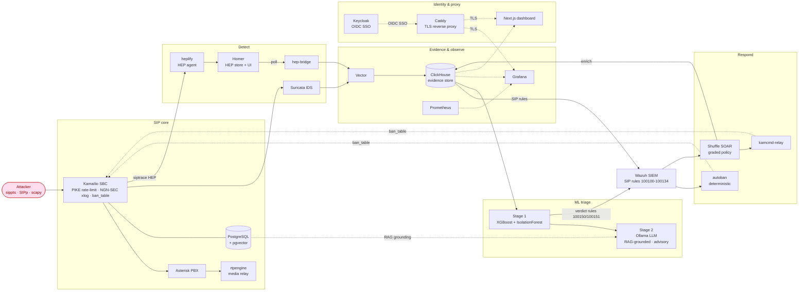
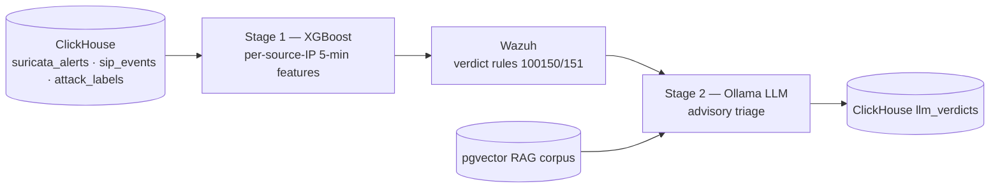
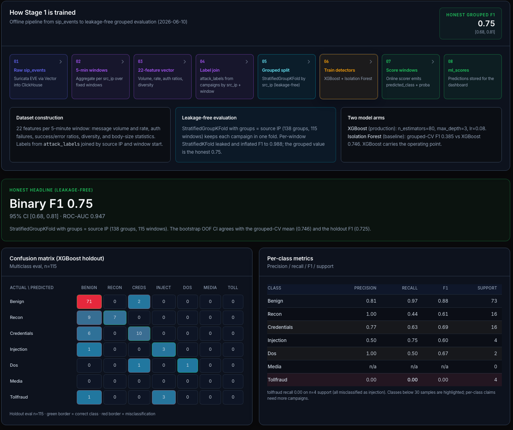
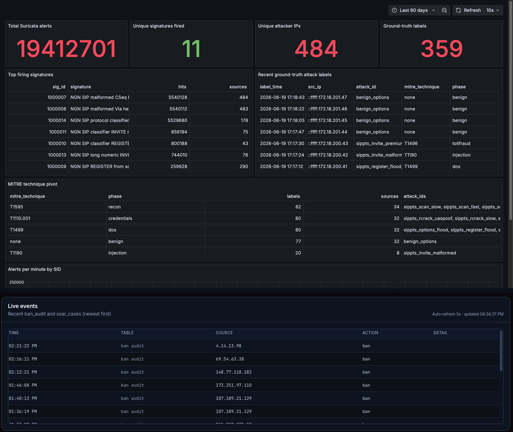
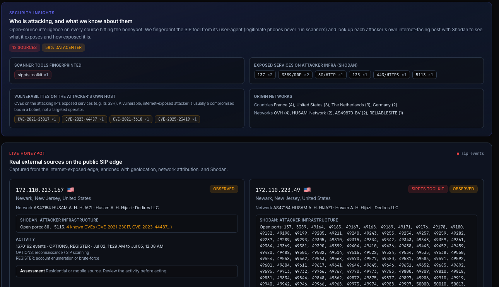

# NGN SIP Attack-Detect-Defend

[](LICENSE)


[](https://github.com/sergioemancinas/ngn-sip-attack-detect-defend/actions/workflows/ci.yml)

## Demo


https://github.com/user-attachments/assets/f62fe960-1003-4489-b81f-ba241d3acd41


A 3-minute walkthrough: live ingress traffic through Suricata and Wazuh detection, ML triage, automated response, and observability.

*Note:* The source IPs shown are real honeypot telemetry captured on the exposed edge; see the data-provenance details under [Results](#results).

A reproducible SIP attack-detect-defend testbed and a candid evaluation study. It generates labeled attack traffic against a real SIP core (Kamailio, Asterisk, rtpengine) and compares three detection arms (Suricata signatures, Wazuh correlation, and an XGBoost classifier) under a leakage-free protocol: source-IP-grouped cross-validation with bootstrap confidence intervals, negative results reported plainly.

Detections drive an audited automated response through Kamailio active response and a graded Shuffle SOAR workflow. An advisory LLM triage stage is included and reported as latency-bound. All evidence lands in ClickHouse and is visible in Grafana and a Next.js dashboard. This repository is the artifact for the accompanying IEEE paper.

> [!WARNING]
> This is a **research lab, not a production platform**. It is lab-secure (loopback-bound, placeholder credentials) by design. Before exposing any of it beyond loopback, follow [`docs/INTERNET_EXPOSURE.md`](docs/INTERNET_EXPOSURE.md).

## Contents

- [Demo](#demo)
- [Security posture](#security-posture)
- [Architecture](#architecture)
- [ML triage](#ml-triage)
- [Results](#results)
- [Quick start](#quick-start)
- [Services and access](#services-and-access)
- [Continuous integration](#continuous-integration)
- [Repository layout](#repository-layout)
- [Deployment](#deployment)
- [Known limitations](#known-limitations)
- [Documentation](#documentation)
- [Ethics](#ethics)
- [License](#license)

## Security posture

- No privileged containers. Every service runs with `no-new-privileges` and `cap_drop: ALL`, re-adding only the capabilities it needs.
- Container base images are pinned by digest and GitHub Actions by commit SHA; Dependabot tracks base images, pip, npm, and Actions.
- No secrets in the repository. Configuration comes from `.env`, copied from the `.env.example` placeholders, and CI runs a blocking Gitleaks scan.
- CI workflows run with least-privilege permissions (`contents: read`); an OpenSSF Scorecard workflow and a release SBOM track supply-chain posture.

## Architecture



The dashed edges are the closed defend loop: both the deterministic `autoban` and the graded Shuffle path enforce bans back at the Kamailio SBC through the shared `ban_table`.

The stack is organized into functional groups sharing one ClickHouse evidence store: the SIP core; detection (Suricata plus Homer/HEP capture); evidence and observability (Vector, ClickHouse, Grafana, Prometheus); ML triage (Stage-1 scorer, Stage-2 Ollama); response (autoban, Shuffle, kamcmd-relay); and identity and proxy (Keycloak, Caddy, the dashboard). Wazuh correlates across the groups and drives active response.

## ML triage



Stage-1 XGBoost scores per-source-IP behaviour; Wazuh turns high-confidence verdicts into alerts; Stage-2 Ollama adds RAG-grounded advisory triage that never overrides Stage-1. Detail in [`ml/README.md`](ml/README.md).

## Results

> [!NOTE]
> **Data provenance.** The shipped model is trained on real campus-VM SIP traffic (labeled campaigns plus a six-day live-internet exposure) aggregated into per-source-IP five-minute behavioural features across 138 source-IP groups. I release the trained model, the provenance-pinned metrics, the training code, a runnable labeled sample, and the full pipeline (`make e2e`); the metrics below are pinned to the committed training-run JSON. Observed attacker source addresses appear in the dashboard and demo as honeypot telemetry: third-party sources, only 7.6% threat-intel-confirmed, so shown as "observed on the exposed edge," not a verified blocklist. See [`docs/DATA_PROVENANCE.md`](docs/DATA_PROVENANCE.md).



- Stage-1 detection, leakage-free protocol. `StratifiedGroupKFold` grouped by source IP with a bootstrap 95% confidence interval gives an XGBoost binary F1 of **0.75 [0.68, 0.81]** and ROC-AUC 0.947. Isolation Forest sits far lower (binary F1 0.38). The earlier 0.988 figure came from `StratifiedKFold` on windows, which leaked whole attack campaigns across folds. Detail in [`docs/results/RESULTS_stage1_grouped.md`](docs/results/RESULTS_stage1_grouped.md).
- C1 HEP response-level features. Adding response-code features (31 versus 16 request-only) raises macro F1 by **+0.013** (0.582 to 0.595) and binary OOF F1 by **+0.015** (0.918 to 0.933). Detail in [`ml/results/RESULTS_c1_hep.md`](ml/results/RESULTS_c1_hep.md).
- Stage-2 LLM triage is advisory only and never overrides a Stage-1 detection. At the benchmarked `qwen2.5:3b` (chosen for CPU-bound latency; the shipped default is `7b-instruct`), it adds no measured false-positive reduction over a simple `attack_score >= 0.6` threshold, and the syntactic prompt-injection guardrail is bypassed by 43% of the adversarial corpus. Both are reported as measured, not tuned away.



End-to-end defend evidence from the campus VM. Top: the Grafana attack-evidence board joins ground truth to detections, with 19.4 million Suricata alerts from 484 unique attacker addresses, 359 attack_labels rows, the top firing signatures, and a MITRE technique pivot. Bottom: live ban_audit rows recording each enforcement decision with source address, action, and timestamps.



Evidence from the exposed SIP edge. Top: the live Kamailio log shows a REGISTER carrying a SQL-injection payload in its SIP URI, and banned sources being dropped at ingress. Middle: sip_events rows show spoofed FreePBX and Polycom user agents and the SIPVicious friendly-scanner, one dialing a premium number. Bottom: Suricata flags the toll-fraud INVITE and ban_audit records the bans, two of them triggered by the Stage-1 ML verdict.

## Quick start

Requires Docker (Engine 26+) with about 18 GiB available to the VM. On macOS, Colima is the tested runtime.

```bash
git clone <this-repository>
cd ngn-sip-attack-detect-defend
cp .env.example .env

make up-all                   # base, IDS, Keycloak, Wazuh, Homer, observability
make ml-up && make ml-pull    # ML ring plus the models (about 4.7 GB)
make soar-up                  # Shuffle SOAR and the ban relay
make bootstrap                # one idempotent pass: indexer OIDC, log collectors, SSO clients, SOAR provisioning
make e2e                      # drive labeled attack traffic and assert every ring produced evidence
```

`make bootstrap` and `make e2e` are safe to re-run. Host ports bind to loopback (`127.0.0.1`) via `DEV_BIND_IP`. Use `localhost` in the browser so OIDC state cookies survive the Keycloak redirect.

## Services and access

Per-service roles, loopback URLs and login details, and the seven provisioned Grafana dashboards (D1-D7) are documented in [`docs/SERVICES.md`](docs/SERVICES.md). Everything binds to loopback by default; the credentials listed there are local lab defaults, to be rotated before any non-loopback exposure.

## Continuous integration

CI is a hard gate: a broken commit fails the pipeline, with no `allow_failure` on the quality jobs. GitHub Actions (`.github/workflows/`) runs and blocks on shell/YAML/Dockerfile lint, `docker compose config` for every Compose file, a Kamailio config check, the `ml/tests` suite, and an observability smoke test. Container builds run a Trivy CRITICAL/HIGH gate, and a Gitleaks secret scan blocks separately.

## Repository layout

```text
.
├── attacks/                    # Attack scripts by phase (01_recon ... 06_tollfraud)
├── caddy/                      # Caddy HTTPS reverse-proxy config
├── dashboard/                  # Next.js stack dashboard
├── docs/                       # Architecture, threat model, runbooks, results, provenance
├── identity/keycloak/          # Keycloak realm and OIDC client configuration
├── ids/suricata/               # Suricata rules and config
├── infra/                      # Per-service Dockerfiles and runtime config
│   ├── clickhouse/             #   ClickHouse: DDL and init for the evidence store
│   ├── kamailio/ asterisk/ …   #   SIP core services
│   └── postgres/               #   Subscriber DB + pgvector
├── observability/              # Metrics and log pipeline
│   ├── vector/                 #   Vector: log/alert shipper into ClickHouse
│   ├── grafana/                #   Provisioned dashboards D1-D7
│   └── prometheus/ hep-bridge/ #   Metrics scrape + HEP bridge
├── ml/                         # Stage 1, Stage 2, eval harness, C1 experiment, tests
├── scripts/                    # Bootstrap, provisioning, and E2E verification helpers
├── siem/wazuh/                 # Wazuh decoders, rules, integrations, active response
├── soar/                       # Shuffle workflow and the kamcmd ban relay
├── docker-compose*.yml         # Compose files split by ring and optional service
└── Makefile                    # up-all, bootstrap, e2e, and per-tier targets
```

ClickHouse configuration lives at `infra/clickhouse/` and Vector at
`observability/vector/`; both run as Compose services (see the `Components`
table above for how to query them live).

## Deployment

Docker Compose is the verified path; the other targets are scaffolding at varying
maturity, each labeled with its real status:

| Path | Where | Status |
|---|---|---|
| Docker Compose + Makefile | `docker-compose*.yml`, `Makefile` | **Verified** end-to-end on a fresh machine (`make up-all` / `make e2e`). |
| Kubernetes (Helm) | `helm/ngn-sip/` | **Design-verified**: lint-clean and `kubeconform -strict`-validated, with deployable-now vs design-only tiers annotated. Not stood up end-to-end. See [`docs/05_kubernetes_migration.md`](docs/05_kubernetes_migration.md). |
| VM provisioning (OpenTofu) | `terraform/proxmox/` | **Skeleton**: resource model and roadmap for a Proxmox reference network. Syntax-checked only; not applied to a live cluster. |
| VM configuration (Ansible) | `ansible/` | **Skeleton**: playbook structure and baseline hardening tasks. `--check`/syntax-checked only; no real secrets or complete service config. |

Use Compose to run the stack. The Helm chart and the VM skeletons document how the
same architecture maps to a cluster and to bare VMs; treat them as design intent,
not turnkey deployments.

## Known limitations

Reported honestly, not defects (the Stage-2 caveats are detailed under [Results](#results)):

- The injection and toll-fraud classes have too few labeled groups for a stable per-class F1.
- Wazuh rule 100151 (Stage-1 high-confidence ML verdict) is enabled for SOC-visible level-10 alerting. Destructive active response is intentionally gated on the external-only `kamailio-autoban` path rather than wired natively to this rule; see the rule header in [`siem/wazuh/rules/ml_rules.xml`](siem/wazuh/rules/ml_rules.xml) for the per-class rationale.

## Documentation

- Threat model (STRIDE and DFD): [`docs/02_threat_model.md`](docs/02_threat_model.md)
- Evaluation methodology (leakage-free source-IP-grouped protocol): [`docs/06_evaluation_methodology.md`](docs/06_evaluation_methodology.md)
- Internet-exposure hardening checklist: [`docs/INTERNET_EXPOSURE.md`](docs/INTERNET_EXPOSURE.md)
- Data provenance and released artifacts: [`docs/DATA_PROVENANCE.md`](docs/DATA_PROVENANCE.md)
- SSO architecture and OAuth hardening: [`docs/sso/keycloak_architecture.md`](docs/sso/keycloak_architecture.md), [`docs/security/oauth_hardening_checklist.md`](docs/security/oauth_hardening_checklist.md)
- SOAR runbook: [`docs/09_soar_runbook.md`](docs/09_soar_runbook.md)

## Ethics

This project is restricted to authorized lab infrastructure, synthetic identities, and synthetic attack traffic. No production systems, third-party networks, or unauthorized targets are in scope. See [`docs/ethics_authorisation.md`](docs/ethics_authorisation.md).

## License

MIT License (see [LICENSE](LICENSE)).
