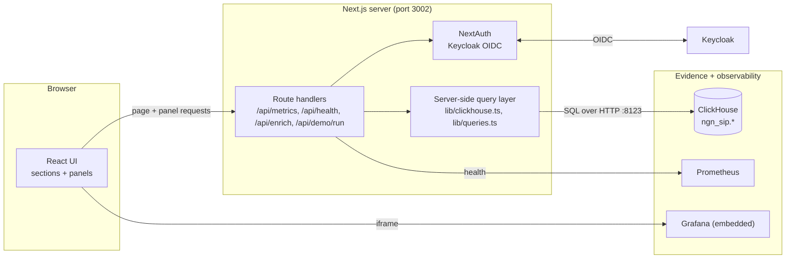

# NGN SIP Dashboard

A Next.js operations dashboard for the SIP attack-detect-defend stack. It is a
read-only view over the evidence the pipeline produces: it queries ClickHouse
server-side, embeds the Grafana boards, and presents the attack-detect-respond
story as navigable sections. Authentication is Keycloak OIDC.

## How it works



- **Server-side data access.** All ClickHouse queries run in Next.js route
  handlers and server components (`lib/clickhouse.ts`, `lib/queries.ts`), so the
  browser never talks to ClickHouse directly and no database credential reaches
  the client.
- **Auth.** `next-auth` with the Keycloak provider (`lib/auth.ts`,
  `app/api/auth/[...nextauth]/route.ts`). In loopback dev it runs open; on the VM
  it enforces OIDC login.
- **Sections and panels.** The left nav (`lib/nav.ts`, `lib/sections.ts`) maps
  the pipeline to sections: ingress/SIP traffic, detection (Suricata + Wazuh),
  ML triage (Stage-1 scores, confusion matrix), LLM verdicts, response (SOAR
  cases, ban audit, response arms), and observability (embedded Grafana). Each
  panel under `components/panels/` reads one ClickHouse table.
- **How-it-works.** `app/how-it-works/` renders the architecture diagram and the
  ML/LLM explainers directly in the UI for a reviewer walkthrough.
- **Demo runner.** `/api/demo/run` can drive a scripted demo sequence for the
  walkthrough.

## Data sources

| Panel area | ClickHouse table(s) |
|---|---|
| SIP traffic, registrations, responses | `sip_events` (response codes included) |
| Detection | `suricata_alerts`, `wazuh_alerts` |
| ML triage | `ml_scores`, `stage1` metrics JSON |
| LLM triage | `llm_verdicts` |
| Response | `soar_cases`, `ban_audit` |
| Ground truth / comparison | `attack_labels`, C3 summary |

Observability panels embed the Grafana boards (`components/grafana/`); system
health is polled from Prometheus via `/api/health`.

## IP enrichment (`/api/enrich`)

Attacker source addresses can be enriched on demand through the auth-gated
`/api/enrich` route (`lib/enrich.ts`, `app/api/enrich/route.ts`). It combines two
free, key-less sources, queried in parallel and cached for six hours:

- **Shodan InternetDB** (`internetdb.shodan.io`): exposed ports, CPEs, tags, and
  known CVEs for the source address.
- **ip-api.com**: geolocation and network attribution (country, city, ASN, ISP,
  and proxy/hosting/mobile flags).

The IP literal is validated before any upstream call (SSRF guard), the upstream
hosts are fixed, and `classifyUserAgent()` fingerprints known SIP scanner
user-agents (SIPVicious, sippts, sipsak, and similar). `HoneypotAttackersPanel`
consumes this endpoint to profile the live-honeypot attackers.

Independent threat-intelligence confirmation (used offline for the
weak-supervision labels) confirmed only a small fraction of the automatically
banned addresses, so the UI presents them as "observed on the exposed edge," not
a verified blocklist. See [`docs/DATA_PROVENANCE.md`](../docs/DATA_PROVENANCE.md).

## Run it

The dashboard is the `dashboard` Compose service, fronted by Caddy.

```bash
make dashboard-up      # build + start on http://127.0.0.1:3002
make dashboard-logs
make dashboard-down
```

Environment: `NEXTAUTH_URL`, the Keycloak client settings, and the ClickHouse
connection are read from `.env` (see `.env.example`).
