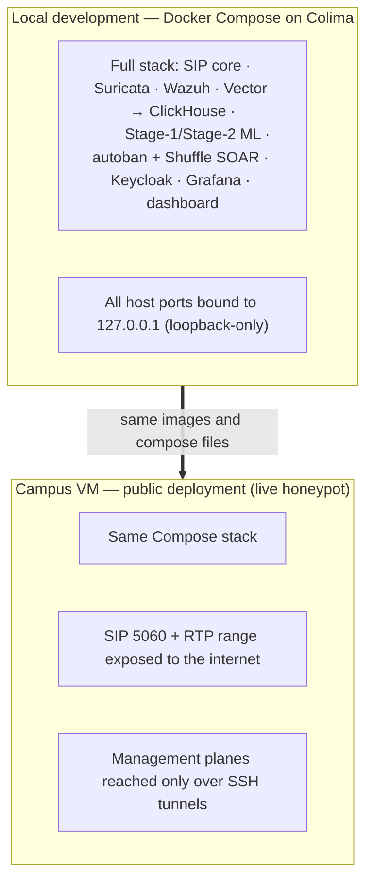
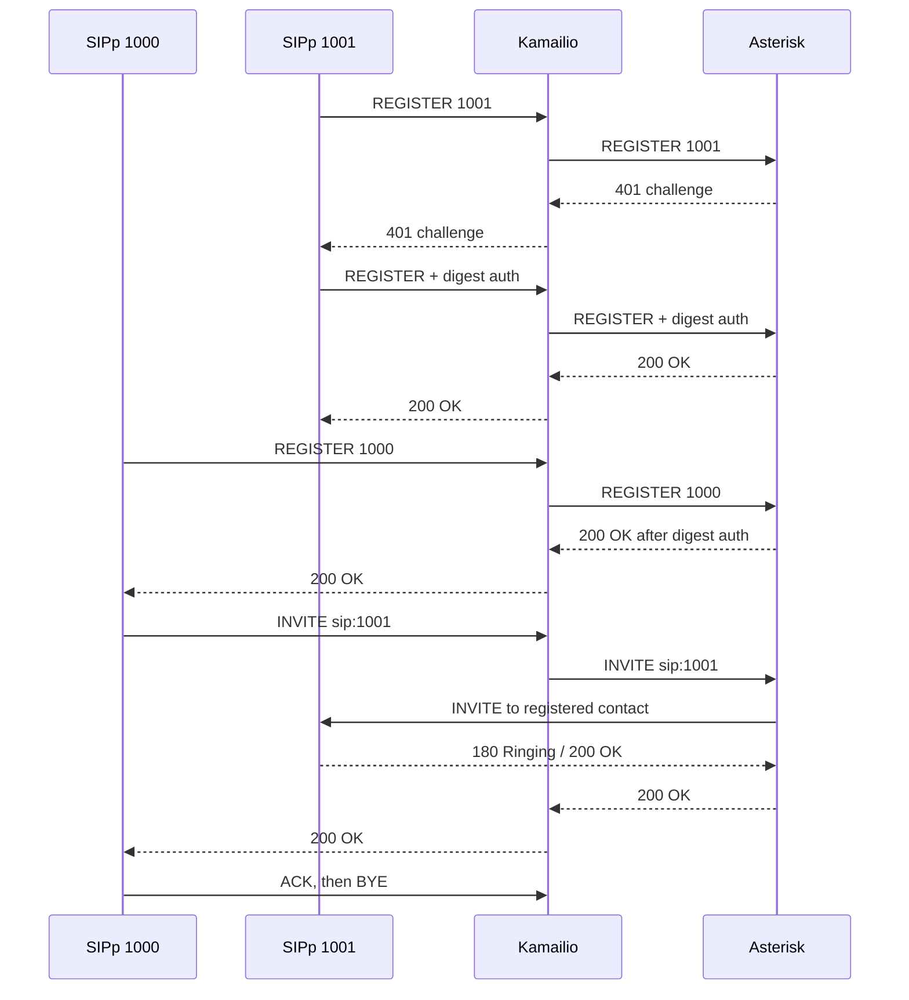

# Architecture

## Deployment View

The full stack runs as one Docker Compose project (`ngn-sip`) with two deployment
targets: local development on Colima, and the campus VM where the SIP edge was
exposed to the internet as a live honeypot. The same images and Compose files are
used in both; only the bind addresses and exposure differ.

For the component-level data flow (attack → detect → score → respond), see the
architecture diagram in the top-level [`README`](../README.md).

## Call Flow

## Notes

Kamailio acts as a forwarding SIP edge while subscriber authentication stays in Asterisk. This is deliberate: it keeps the edge policy (Pike, SecFilter, the ban table) separate from PBX authentication. Homer HEP capture and rtpengine media handling are part of the delivered stack.

<!-- TODO: expand this into deployment, data-flow, and control-flow views after smoke testing. -->
