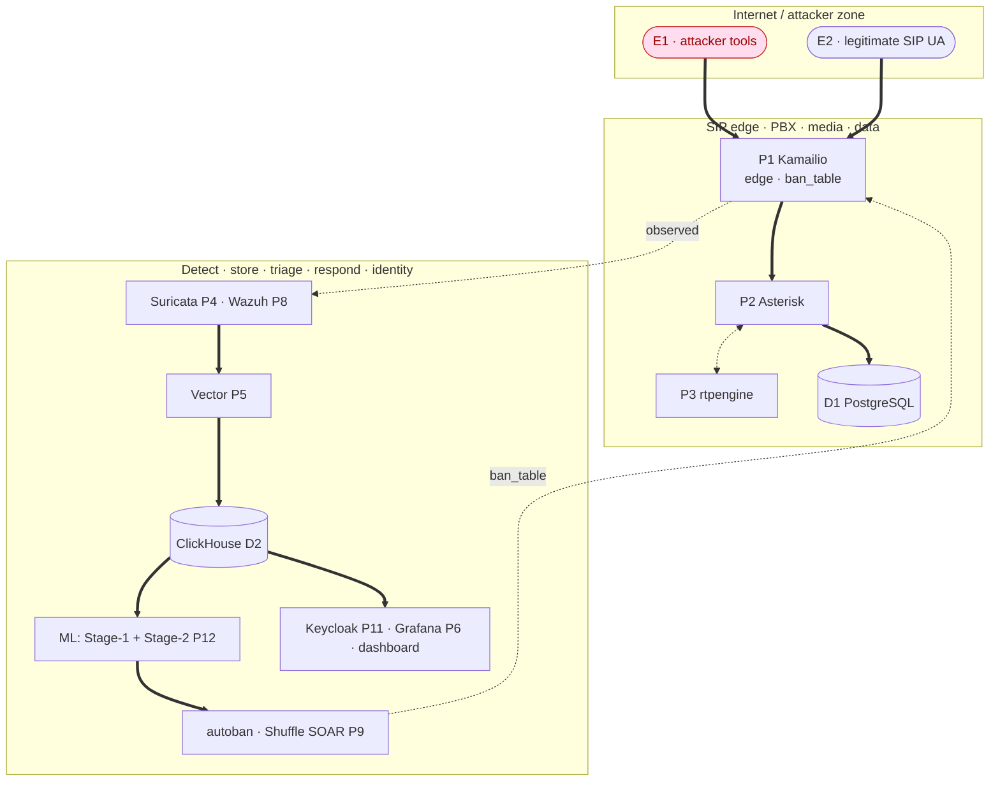

# Threat Model

## Scope And Evidence

This threat model covers the SIP Attack-Detect-Defend lab stack in its Compose-first development form and the later campus VM deployment posture. The model is grounded in the current repository artefacts:

- `docs/01_architecture.md`, which defines Kamailio, Asterisk, rtpengine, and PostgreSQL as the SIP core.
- `docker-compose.yml`, `docker-compose.ids.yml`, `docker-compose.observability.yml`, `docker-compose.wazuh.yml`, `docker-compose.soar.yml`, `docker-compose.keycloak.yml`, and `docker-compose.ml.yml`, which define the running services and host exposure.
- `infra/kamailio/`, `infra/asterisk/`, and `infra/rtpengine/`, which define the SIP edge, PBX, and media relay behavior.
- `ids/suricata/rules/sip.rules`, which defines Suricata SIDs `1000001` to `1000014`.
- `siem/wazuh/rules/sip_rules.xml`, which defines Wazuh SIDs `100100` to `100134`.
- `attacks/01_recon/` through `attacks/06_tollfraud/`, which define the implemented attack catalogue.

Local development binds host-published services to `127.0.0.1` through `DEV_BIND_IP` by default. Public SIP and RTP exposure is deferred to the campus VM phase. The VM posture remains: UFW default-deny, only SIP/SIPS plus the configured RTP range exposed, SSH key-only on a non-standard port, Fail2Ban, Docker `--iptables=false`, and dashboards reachable only through an SSH tunnel or management network.

External LLM APIs are not part of runtime. Stage 2 triage uses local Ollama with Qwen 2.5 7B when the ML stack is enabled.

## Assets

| Asset | Security property that matters | Repository evidence |
|---|---|---|
| SIP signaling | Integrity and availability of REGISTER, INVITE, ACK, BYE, OPTIONS, challenges, routing state, and caller identity. | `infra/kamailio/kamailio.cfg`, `infra/asterisk/etc/pjsip.conf` |
| SIP credentials and extension state | Confidentiality of shared secrets, integrity of registration and authentication state. | `infra/asterisk/etc/pjsip.conf`, `.env.example` placeholders |
| Media path | Confidentiality, integrity, and availability of RTP/SRTP streams and rtpengine control state. | `infra/rtpengine/`, `docker-compose.yml` |
| Subscriber and context data | Integrity and confidentiality of PostgreSQL and pgvector data. | `infra/postgres/init/`, `docker-compose.yml` |
| Detection evidence | Integrity and non-repudiation of Suricata EVE JSON, Wazuh alerts, Asterisk logs, labels, and ClickHouse records. | `ids/suricata/`, `siem/wazuh/`, `observability/vector/vector.yaml` |
| Response state | Integrity of Kamailio `ban_table`, Wazuh active response, Shuffle workflow decisions, and ClickHouse `soar_cases` rows. | `infra/kamailio/modules/htable.cfg`, `siem/wazuh/active-response/kamcmd_block.sh`, `soar/shuffle/workflows/sip_response_orchestration.json` |
| Admin and observability control plane | Confidentiality and integrity of Grafana, Wazuh Dashboard, Keycloak, Shuffle, Prometheus, ClickHouse, and Ollama. | Compose files and provisioned configs under `observability/`, `siem/`, `soar/`, and `identity/` |

## Trust Boundaries And Data Flow Diagram

Trust boundaries and the primary attack → detect → respond flow. To stay
readable, the diagram shows the main spine only. Every element (E/P/D) and all 24
data flows (F1-F20, F22-F25; there is no F21) are enumerated with their STRIDE
analysis in the two tables below.

## STRIDE Per Element

Core STRIDE analysis for the entity, process, and data-store nodes (E/P/D). The
24 data flows (F1-F24 numbering) are analysed separately in the compact
data-flow table below, which references these elements rather than repeating the
matrix.

> Note: there is no P10. Process IDs (P1-P9, P11, P12) are kept stable to match
> the data-flow diagram, detection configs, and earlier drafts rather than
> renumbered.

| ID | Element | Spoofing | Tampering | Repudiation | Information disclosure | Denial of service | Elevation of privilege |
|---|---|---|---|---|---|---|---|
| E1 | Attacker tools | Source IP and User-Agent spoofing. | Malformed SIP and RTP payloads. | Tool runs may not be attributable without labels and PCAPs. | Fingerprints banners, extensions, and media ports. | Floods SIP edge, PBX, and media ports. | Attempts to reach admin or automation surfaces. |
| E2 | Legitimate SIP UA | Stolen extension credentials or forged Contact. | Client misconfiguration corrupts registration state. | Shared test users make user attribution weak. | SIP headers reveal extension and topology data. | Re-registration storms after reconnects. | Compromised UA becomes internal pivot. |
| P1 | Kamailio SIP edge | Forged From, Contact, Via, or source address. | Route manipulation, header injection, malicious htable changes. | Missing security xlog events weaken attribution. | Server banners, route state, extension hints. | REGISTER, INVITE, OPTIONS, BYE, NOTIFY, and SUBSCRIBE floods. | Control socket or container compromise affects edge policy. |
| P2 | Asterisk PBX | Digest auth brute force or valid account misuse. | Dial plan or endpoint state manipulation. | PBX logs can be overwritten or fail to preserve source context. | PJSIP logs and CDR data expose extensions and call attempts. | Auth storms, call floods, expensive dial-plan paths. | PBX process or config compromise can bypass SIP edge policy. |
| P3 | rtpengine media relay | RTP source, SSRC, or endpoint spoofing. | RTP injection, sequence manipulation, codec abuse. | Media-path events are hard to attribute without synchronized call context. | RTP capture can expose audio or call metadata. | Packet floods and RTP port exhaustion. | Control interface compromise can redirect media. |
| D1 | PostgreSQL + pgvector | Stolen DB user impersonation. | Subscriber, label, or RAG-context modification. | Weak audit trails obscure who changed rows. | Extension, credential, and context leakage. | Exhausted connections or storage. | DB superuser or extension abuse. |
| P4 | Suricata IDS | Evasion by spoofed UA or traffic not visible to sensor. | Rule file or EVE output tampering. | Missing PCAP or event hashes weaken evidence. | EVE JSON contains IPs, URIs, User-Agent, and call IDs. | High packet rates overload capture. | Capture capabilities increase container risk. |
| P5 | Vector pipeline | Spoofed source fields inside logs. | Transform poisoning and malformed JSON. | Dropped events reduce evidence completeness. | Raw logs may contain credentials or topology. | File backlogs and ClickHouse write pressure. | Pipeline config compromise changes stored evidence. |
| D2 | ClickHouse | Stolen `ngn` credentials. | Alert, label, and verdict row tampering. | No immutable audit by default. | Central store exposes SIP metadata and security events. | Query or insert load degrades dashboards and labels. | Over-privileged datasource or user grants. |
| P6 | Grafana | Stolen admin, local, or OIDC session. | Dashboard and datasource manipulation. | Shared accounts weaken change attribution. | Queries expose security and SIP metadata. | Heavy dashboards or plugin faults. | Admin role abuse grants datasource access. |
| P7 | Prometheus | Spoofed scrape target metadata. | Metric series poisoning. | Metrics alone rarely prove actor identity. | Service names, ports, and health state are visible. | High-cardinality series and scrape failures. | Config write access reveals targets and credentials if added later. |
| P8 | Wazuh manager, indexer, dashboard | Stolen Wazuh or OIDC credentials. | Rule, decoder, alert, and index tampering. | Alert deletion or index changes hide actions. | Alerts contain source IPs, SIP users, and remediation context. | Indexer, manager, or dashboard resource exhaustion. | Manager API or active-response misuse affects SIP edge. |
| P9 | Shuffle SOAR | Spoofed webhook or stolen API key. | Workflow edits alter containment. | Missing execution logs obscure who approved action. | Cases and enrichment reveal attack context. | Workflow loops or external API waits. | Worker or Orborus compromise can execute actions with workflow privileges. |
| P11 | Keycloak | Stolen admin password, client secret, or session. | Realm, role, and client redirect manipulation. | Weak audit makes identity changes disputable. | Tokens and profile claims disclose identities and roles. | Login or token endpoint overload. | Realm admin compromise grants dashboard access. |
| P12 | Ollama Stage 2 triage | Prompt source spoofing through poisoned retrieval context. | Prompt injection alters verdict text. | Generated verdicts need source event references. | Prompts can expose SIP logs or case details. | Large prompts or concurrent model loads. | Model service compromise can influence triage decisions. |

## Data Flows (STRIDE)

Compact analysis of the 24 data flows. Each flow lists its dominant STRIDE
risk(s) and points to the element rows above and the mitigations in the Ranked
Threat Register; it does not repeat the full six-category matrix. Flow IDs skip
F21 (kept stable to match the diagram and earlier drafts); the enumeration is
therefore F1-F20 and F22-F25.

All 24 data flows (F1-F20, F22-F25)

| ID | Data flow | Primary STRIDE risk(s) | Note / element reference |
|---|---|---|---|
| F1 | Attacker SIP to Kamailio | Denial of service, Spoofing, Tampering | Primary flood and malformed-input path into the edge; source/UA spoofing, malformed headers/SDP/URIs. See P1. |
| F2 | Legitimate UA SIP to Kamailio | Spoofing | Credential replay or registration hijack; reconnect storms resemble floods. See E2, P1. |
| F3 | UA media to rtpengine | Information disclosure, Spoofing | RTP source spoofing, payload/SSRC manipulation, packet flood. See P3. |
| F4 | Kamailio to Asterisk SIP | Elevation of privilege | Abuse of trusted proxy position; edge and PBX logs may disagree. See P1, P2. |
| F5 | Asterisk to PostgreSQL | Tampering, Information disclosure | Subscriber/state writes and extension/credential exposure; DB audit gaps. See D1. |
| F6 | Asterisk to rtpengine | Tampering, Denial of service | Media control/relay manipulation and port-range exhaustion. See P3. |
| F7 | Suricata observation of SIP bridge | Repudiation | Capture loss under load and evasion via parser edge cases; gaps disputable without PCAP. See P4. |
| F8 | Suricata EVE to Vector | Tampering, Information disclosure | EVE file tampering; alert JSON discloses IPs, URIs, call IDs. See P4, P5. |
| F9 | Asterisk logs to Vector | Tampering, Information disclosure | Log injection or truncation; auth-failure and endpoint names exposed. See P5. |
| F10 | Wazuh alerts to Vector | Repudiation, Tampering | Event loss affects chain of custody; transformation errors. See P8, P5. |
| F11 | Vector to ClickHouse | Tampering, Elevation of privilege | Wrong schema mapping or row manipulation; write-credential abuse. See P5, D2. |
| F12 | ClickHouse to Grafana | Information disclosure, Elevation of privilege | SIP events and alert history exposed; Grafana admin to datasource pivot. See D2, P6. |
| F13 | Prometheus to Grafana | Tampering, Information disclosure | Misleading metric values; service-inventory exposure. See P7, P6. |
| F14 | Prometheus scrape of Kamailio | Denial of service, Tampering | Scrape amplification or target overload; metric poisoning. See P7, P1. |
| F15 | Prometheus scrape of Asterisk | Tampering, Denial of service | PBX metric poisoning; scrape failures or high-cardinality data. See P7, P2. |
| F16 | Prometheus scrape of rtpengine | Tampering | Media metric poisoning; metric-endpoint overload. See P7, P3. |
| F17 | Kamailio logs to Wazuh | Spoofing, Repudiation | Spoofed `NGN-SEC` source fields; missing logs break attribution; log storm. See P1, P8. |
| F18 | Asterisk logs to Wazuh | Tampering, Elevation of privilege | Decoder mismatch; active response from forged alert. See P2, P8. |
| F19 | Wazuh alerts to Shuffle | Spoofing, Elevation of privilege | Spoofed webhook sender; unauthorized workflow action. See P8, P9. |
| F20 | Shuffle to Kamailio active response | Elevation of privilege, Denial of service | Unauthorized/wrong `ban_table` entry blocks legitimate peers; overblocking. See P9, P1. |
| F22 | Keycloak to Grafana | Spoofing, Elevation of privilege | Token/session spoofing; role claim manipulation grants admin. See P11, P6. |
| F23 | Keycloak to Wazuh Dashboard | Spoofing, Elevation of privilege | Role-mapping tampering; dashboard admin grant. See P11, P8. |
| F24 | ClickHouse to Ollama | Tampering, Information disclosure | Poisoned retrieval context and prompt injection from stored events. See D2, P12. |
| F25 | Wazuh to Ollama | Tampering, Repudiation | Forged alert context; advisory verdicts need traceable alert IDs. See P8, P12. |

## Ranked Threat Register

Likelihood and impact are qualitative and ranked for the local lab plus the later campus VM. Detection mappings list only SIDs that exist in the repository. Conditional mappings mean the SID exists but depends on the corresponding log event or packet path being produced. Suricata SIDs marked `†` are defined in `ids/suricata/rules/sip.rules` but currently disabled (11 of the 14 SIDs are active; `1000010`, `1000011`, and `1000014` are commented out as pure-observation classifiers), so they are shown for completeness but do not fire as configured.

| Rank | ID | STRIDE category | Affected element | Description | Likelihood | Impact | Mitigating control or accepted risk | Detection mapping |
|---:|---|---|---|---|---|---|---|---|
| 1 | T-01 | Denial of Service | F1, P1 Kamailio | Public or lab attacker floods REGISTER, INVITE, OPTIONS, BYE, NOTIFY, or SUBSCRIBE until the edge drops valid SIP traffic. | High in VM, Medium locally | High | Keep local SIP loopback-only. In VM expose only 5060/5061 and RTP range, tune Pike/SecFilter, keep UFW default-deny, and use `ban_table` active response for high-confidence sources. | Suricata `1000004`, `1000005`, `1000010†`, `1000011†`, `1000014†`; Wazuh `100103`, `100108`, `100111`, `100112`, `100122`, `100123`, conditional on Pike or `NGN-SEC` method events. |
| 2 | T-02 | Spoofing | F2, P2 Asterisk | Brute-forced or reused SIP credentials allow registration hijack, unauthorized call attempts, voicemail access, or toll-fraud simulation. | High | High | Replace demo secrets before exposure, keep Asterisk behind Kamailio, restrict dial plan, monitor auth failures, and ban sources only after correlated thresholds. | Suricata `1000009`, `1000010†`, `1000012`; Wazuh `100101`, `100102`, `100104`, `100105`, `100106`, `100128`, `100129`. |
| 3 | T-03 | Elevation of Privilege | P9 Shuffle, F20 active response | Spoofed webhooks, stolen Shuffle credentials, or edited workflows trigger unauthorized `kamcmd` actions and block legitimate SIP peers. | Medium | High | Keep Shuffle loopback-only, authenticate webhook sources, version workflow JSON, require human approval for new destructive workflows, and review AR logs. | Wazuh `100131` observes ban hits and `100132` observes response acknowledgements. No project SID proves webhook authenticity. |
| 4 | T-04 | Elevation of Privilege | P8 Wazuh manager, indexer, dashboard | SIEM compromise grants access to alerts, indexed evidence, manager API, and active-response capability. | Medium | High | Keep Wazuh ports loopback-only, use generated TLS certs, rotate `WAZUH_*` secrets, use Keycloak/OIDC for dashboard access, and limit manager API exposure. | No SIP-specific SID detects Wazuh control-plane compromise. Wazuh `100132` can record response acknowledgement after action. |
| 5 | T-05 | Tampering | F1, P1 Kamailio | Malformed Via, CSeq, From, To, or SDP payloads attempt parser abuse, route manipulation, or module crash. | High | Medium | Keep `sanity_check`, read-only Kamailio config, bounded containers, Suricata signatures, and staged fuzz testing against lab-only targets. | Suricata `1000006`, `1000007`, `1000008`, `1000011†`, `1000014†`; Wazuh `100113`, `100114`, `100115`, `100116`, `100117` if `NGN-SEC` malformed reasons are emitted. |
| 6 | T-06 | Information Disclosure | P3 rtpengine, F3 media | RTP interception, blind RTP injection, SSRC guessing, or media-port sweeps reveal or alter call content. | Medium | High | Expose only the configured RTP range in VM, keep rtpengine control internal, prefer SRTP where in scope, and capture media only for approved lab evidence. | Wazuh `100120`, `100121`, `100134` if Kamailio or Asterisk logs media anomalies. No Suricata RTP SID exists for the current script. |
| 7 | T-07 | Spoofing | P1 Kamailio, F2 registration | Contact-header spoofing or identity mismatch redirects registrations or creates confusing call routing state. | Medium | High | Validate Contact and source consistency before VM exposure, keep topology hiding controls, and treat multi-homed endpoints as allowlist exceptions. | Wazuh `100110`; Suricata has no Contact-spoof specific SID. |
| 8 | T-08 | Tampering | P2 Asterisk, dial plan | Premium-prefix INVITEs or valid-account misuse attempt toll fraud or policy-bypassing routes. | Medium | High | Keep no external PSTN or premium route in lab, restrict dial plan, block high-risk prefixes, and review failed premium attempts. | Suricata `1000011†`, `1000013`, `1000014†`; Wazuh `100118`, `100119`, `100133` if Kamailio or Asterisk logs include the destination. |
| 9 | T-09 | Information Disclosure | F1, F4 SIP transport | SIP-over-TCP or TLS downgrade and adversary-in-the-middle behavior exposes signaling or weakens identity assurances. | Medium in VM | High | Use step-ca for TLS, avoid cleartext admin paths, document any legacy UDP interop as accepted risk, and test downgrade detection. | Wazuh `100130` if transport-downgrade reasons are emitted. No Suricata downgrade SID exists. |
| 10 | T-10 | Denial of Service | P2 Asterisk | Direct or relayed auth storms and call floods consume PBX threads, logs, and dial-plan execution. | Medium | High | Do not publish Asterisk host ports, keep Kamailio as the only SIP ingress, enforce resource limits, and monitor PJSIP auth failures. | Wazuh `100104`, `100105`, `100133`, `100134`; Suricata `1000009`, `1000010†`, `1000011†`, `1000012` if traffic is visible to the sensor. |
| 11 | T-11 | Repudiation | P4 Suricata, F7 observation | Apple Silicon Docker capture limitations or missing PCAPs let an attacker dispute IDS evidence. | Medium | Medium | Accepted local-only risk: local development uses Suricata evidence, while production-like packet capture must be validated on Linux campus VM with saved PCAPs. | Suricata SIDs can fire, but absence of an alert is not proof of absence in local capture mode. |
| 12 | T-12 | Tampering | P5 Vector, F8 to F11 pipeline | Attacker-controlled SIP headers or malformed JSON poison parsing and stored evidence. | Medium | Medium | Prefer structured EVE JSON, keep Vector config read-only, preserve raw fields, validate transforms with fixtures, and separate detection decisions from untrusted text. | No direct SIP SID. Secondary evidence appears as mismatched ClickHouse rows or missing expected Suricata/Wazuh rows. |
| 13 | T-13 | Information Disclosure | D2 ClickHouse | Attack labels, SIP events, alerts, and verdicts expose source IPs, extension IDs, URIs, and lab topology. | Medium | Medium | Keep HTTP API loopback-only, do not expose native TCP host port, rotate `CLICKHOUSE_PASSWORD`, and limit Grafana datasource privileges. | No project SID for ClickHouse data access. |
| 14 | T-14 | Tampering | D1 PostgreSQL + pgvector | Subscriber, credential, or future retrieval-context rows are modified, corrupting auth, call routing, or Stage 2 context. | Low locally, Medium VM | High | Keep service internal, rotate DB password, keep init scripts read-only, add backups and migrations before VM deployment. | No SIP SID. DB audit is a monitoring gap. |
| 15 | T-15 | Information Disclosure | P6 Grafana | Dashboard or datasource compromise exposes ClickHouse queries, Prometheus metrics, labels, and internal service names. | Medium | Medium | Loopback bind, sign-up disabled, strong admin password, Keycloak/OIDC, least-privilege datasource, and no public snapshots. | No SIP SID. Grafana access logs are separate control-plane evidence. |
| 16 | T-16 | Spoofing | P11 Keycloak | Weak admin password, leaked client secret, or role mapping error grants Grafana or Wazuh dashboard access. | Medium | High | Accepted for local reproducibility only while loopback-bound. Before VM rollout, rotate client secrets, use production mode, HTTPS, named users, and audit logging. | No SIP SID. Keycloak audit export to SIEM is a future control. |
| 17 | T-17 | Repudiation | P8 Wazuh indexer | Alert deletion, index tampering, or role abuse hides attacks and active-response decisions. | Medium | High | Persist indexer data, restrict admin roles, mirror major cases to ClickHouse `soar_cases`, and retain AR logs. | No SIP-specific SID for index tampering. Wazuh rule hits remain evidence only if indexes and logs are preserved. |
| 18 | T-18 | Denial of Service | P12 Ollama Stage 2 | Large prompts or concurrent triage jobs exhaust CPU/RAM and delay Wazuh or Shuffle processing. | Medium | Medium | Keep Ollama loopback-only, cap model concurrency, keep verdict generation asynchronous, and treat LLM output as advisory. | No SIP SID. Prometheus host and container metrics are the detection path. |
| 19 | T-19 | Tampering | P7 Prometheus, F14 to F16 metrics | Metric poisoning or scrape target spoofing misleads dashboard health and attack-rate interpretation. | Low | Medium | Provision scrape config read-only, keep Prometheus loopback-only, and use metrics as supporting evidence, not primary attack attribution. | No SIP SID. Compare with Suricata, Wazuh, and ClickHouse event counts. |

## Detection Gap Summary

| Gap | Impact | Current handling |
|---|---|---|
| Kamailio `NGN-SEC` dependency | Many Wazuh child rules require Kamailio security logs with `event_type`, `srcip`, `user_agent`, and `reason`. | Treat Wazuh mappings for Kamailio-derived rules as conditional unless log emission is proven in the same test run. |
| Media detection | `attacks/05_media/rtp_inject.sh` exists, but no Suricata RTP SID exists and Wazuh media rules require Kamailio or Asterisk media anomaly logs. | Mark as partial coverage. Use packet capture and rtpengine/Asterisk logs until dedicated media signatures are added. |
| Control-plane compromise | Wazuh, Shuffle, Grafana, Keycloak, ClickHouse, Prometheus, and Ollama do not have SIP-specific SIDs for compromise. | Keep loopback-only, rotate secrets before VM exposure, enable audit logs, and treat these as management-plane risks. |
| Local IDS visibility | Suricata in Docker on Apple Silicon is useful for rule development but not equivalent to VM packet capture. | Accepted local-only risk. Production-like evidence must be captured on the Linux campus VM. |
| Automated response scope | Only Wazuh SIDs `100102`, `100103`, `100105`, and `100108` are wired to Shuffle and `kamcmd_block.sh`. | Keep other attack classes evidence-only until response thresholds and false-positive handling are proven. |

## Response-Tier Components (kamcmd-relay, Shuffle, ML services)

Added when the automated-response tier was built. Each is a new trust boundary.

| Element | Threat | Control |
|---|---|---|
| **kamcmd-relay** (HTTP → `kamcmd htable.sets`) | Spoofed SIP-over-UDP source → attacker forges a peer/internal IP so the ban DoSes the stack (blocklist poisoning). | Bare-IP-literal validation before `kamcmd`; never-ban allowlist = protected-container IPs + `NEVER_BAN_IPS` + the relay's own IPs; RFC1918/loopback/multicast refused unless `RELAY_ALLOW_PRIVATE=1` (lab only). |
| **kamcmd-relay** auth | Unauthenticated caller triggers arbitrary bans. | Fail-closed bearer token (`RELAY_TOKEN`, constant-time compare); relay refuses to start without one. Every outcome (incl. `reject_unauthorized`) audited to `ban_audit`. |
| **kamcmd-relay / autoban** Docker socket | A relay or autoban compromise escalates to host control via the mounted socket. | Socket mounted read-only; container `cap_drop: ALL` + `no-new-privileges` + read-only rootfs. Internet-facing: front the socket with a scoped exec-only proxy (see `docs/INTERNET_EXPOSURE.md`). |
| **Shuffle webhook** | Untrusted alert JSON injected into ClickHouse enrichment queries (SQLi). | `parse_alert` enforces a bare-IP-literal gate on `srcip` before it reaches any query; enrichment queries parameterize on the sanitized value. |
| **Shuffle graded decision** | A single detection over-bans (false positive → self-inflicted DoS). | Graded corroboration: ban only when `level>=10` AND ML/LLM corroborate; below the low threshold records a case only. autoban remains the deterministic backstop; both converge on `ban_table`/`ban_audit`. |
| **Stage-2 LLM triage** | Prompt injection via attacker-controlled alert text flips a verdict. | Untrusted text wrapped/sanitized; a syntactic guardrail forces `needs_review` on injection patterns; the LLM is advisory only and never overrides a Stage-1 detection (residual bypass reported honestly). |
| **Shuffle OIDC** | Shuffle 2.2.0 uses OAuth implicit flow when a client secret is set. | `implicitFlowEnabled` scoped to the `shuffle` Keycloak client only; loopback-bound. Prefer auth-code + PKCE if a future Shuffle release supports it. |

**Residual risk: source-IP banning is defeated by SIP-over-UDP spoofing for
public addresses.** The never-ban allowlist protects the stack's own containers,
loopback, and (by default) RFC1918 space, but a *spoofed public IP* of a
legitimate peer or carrier is `is_global` and not allow-listed, so an attacker
who forges SIP traffic with a victim's source address can get that victim banned
at the SBC edge (blocklist poisoning / third-party DoS), bounded only by the
`ban_table` autoexpire (3600 s). This is inherent to source-IP enforcement on a
connectionless, spoofable transport, not a bug in the relay. Accepted for the
lab; before any real deployment, require corroboration (e.g. a completed
registration or transaction from the source) before a public IP is bannable, or
keep public-IP responses in an alert-only / short-TTL tier. Documented so the
ban mechanism is not mistaken for spoof-resistant.
