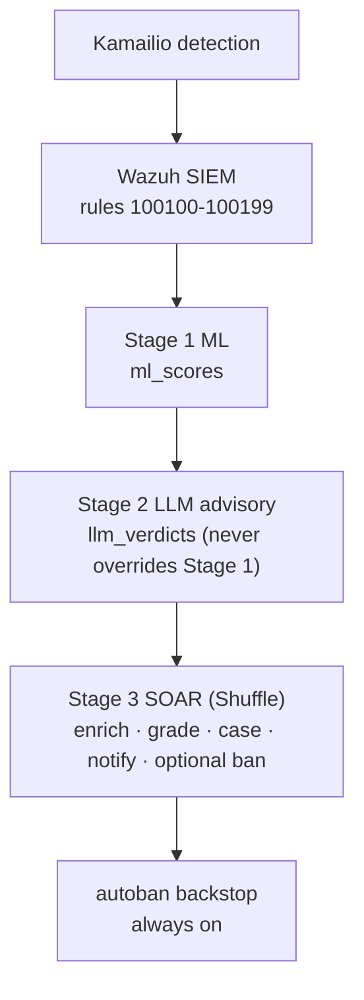

# SOAR Runbook (Shuffle Stage 3)

Operational runbook for the Shuffle SOAR orchestration tier. Stage 3 sits above the deterministic `kamailio-autoban` backstop and the Stage 1/2 detection layers.

## Role in the pipeline



Shuffle adds enrichment, a graded decision, case management, and notification.
`kamailio-autoban` stays the deterministic reactive ban loop that polls
ClickHouse and writes `ngn_sip.ban_audit`.

## Deploy order

Run from the repo root on a host with Docker and the lab `.env` configured.

| Step | Command / action | Gate |
|---|---|---|
| 1 | Core SIP stack up | Kamailio emits NGN-SEC events |
| 2 | Observability up (`make obs-up`) | ClickHouse HTTP on `sip_lab` port 8123 |
| 3 | Wazuh up (`make wazuh-up`) | Rules 100100-100199 loaded |
| 4 | ML up (`make ml-up`) optional for enrichment | `llm_verdicts` / `ml_scores` populated under attack |
| 5 | SOAR up (`make soar-up`) | Shuffle UI on `127.0.0.1:3001`, API on `127.0.0.1:5001` |
| 6 | Provision Shuffle (`make shuffle-provision`) | Workflow imported, webhook running, `soar_cases` ensured, Wazuh XML hook_url rewritten |
| 7 | Wire Wazuh integration | See next section |
| 8 | Confirm autoban sidecar running | `kamailio-autoban` polls every 5 s |

Step 6 replaces the old manual flow (create table, UI import, org variables,
copy webhook URL): `scripts/provision_shuffle.sh` does all of it over the
Shuffle REST API and is idempotent (`DRY_RUN=1` to preview, `--sso` to also
configure Keycloak OpenID).

Do not disable autoban during normal operation. SOAR and autoban both target `ban_table` via the same kamcmd contract.

## Wazuh -> Shuffle wiring

The integration block is defined in `siem/wazuh/integrations/wazuh_shuffle_integration.xml`:

- `<name>shuffle</name>`
- `<level>10</level>` (alerts at level 10 and above)
- `<rule_id>100102,100103,100105,100108</rule_id>` (subset of 100100-100199; expand to full range when Stage 3 is live)
- `<hook_url>http://shuffle-backend:5001/api/v1/hooks/webhook_&lt;trigger-id&gt;</hook_url>`

The hook URL must match the webhook trigger of the imported orchestration
workflow. Shuffle mints the trigger id per install, so the URL is not knowable
in advance - `scripts/provision_shuffle.sh` reads the generated id back from
the saved workflow and rewrites `<hook_url>` in the XML automatically.

Install idempotently:

```bash
./siem/wazuh/integrations/install_integrations.sh
```

Dry-run preview:

```bash
./siem/wazuh/integrations/install_integrations.sh --dry-run
```

Remove integration (measurement campaigns that must not trigger SOAR):

```bash
./siem/wazuh/integrations/install_integrations.sh --remove
```

## Pause SOAR for clean measurement campaigns

Use these controls independently. Document which layers were paused in the lab notebook.

| Layer | Pause method | Effect |
|---|---|---|
| SOAR orchestration | `install_integrations.sh --remove` or deactivate workflow in Shuffle UI | No webhook executions, no `soar_cases` writes from Shuffle |
| SOAR only (keep Wazuh posting) | Deactivate workflow in Shuffle UI | Wazuh still POSTs; Shuffle drops inactive workflows |
| Deterministic ban backstop | `docker stop kamailio-autoban` | No autoban polling; **measurement only**, stack is undefended at edge |
| Stage 2 LLM | `docker stop` Stage 2 worker container | Enrichment returns empty verdict; graded policy falls back to ML score + Wazuh level |
| Stage 1 scorer | stop stage1 container | `ml_scores` enrichment empty |

For C3 evaluation arms that compare detection-only vs defend, stop autoban and record the arm in the experiment log. Keep SOAR paused unless the arm explicitly tests orchestration overhead.

## Workflow reference

Primary workflow: `soar/shuffle/workflows/sip_response_orchestration.json`

Node-level documentation: `soar/shuffle/workflows/README.md`

## Graded-response policy

Aligned with graded overload control (RFC 5390: prefer throttling and selective response over all-or-nothing drop). Stage 2 verdicts **inform** the branch; they do not disable autoban.

| `graded_action` | Entry conditions | SOAR acts | autoban backstop |
|---|---|---|---|
| `skip_protected` | src_ip in never-ban allowlist (same list as `autoban_loop.sh`) | Write `soar_cases` only | Skips protected sources |
| `dedup_suppressed` | Same src_ip had a non-suppressed case within `${SOAR_DEDUP_WINDOW_SECONDS}` (default 300 s) | Exit | Unaffected |
| `ban` | Stage 2 `malicious`, OR `attack_score >= ${ATTACK_SCORE_BAN_THRESHOLD}` (default 0.85), OR Wazuh level >= 12 | kamcmd `command=add` via relay, notify, case | Also bans if rule in window |
| `rate_limit_notify` | Stage 2 `suspicious` or `needs_review`, OR mid-range ML score | Notify + case; rely on PIKE edge rate limit | May still ban on sustained high-severity alerts |
| `log_only` | Stage 2 `benign` AND Wazuh level == 10 AND `attack_score < ${ATTACK_SCORE_LOW_THRESHOLD}` (default 0.55) | Case tagged FP candidate | May still ban if alert persists in poll window |

Thresholds are Shuffle org variables. Tune from measured FP/TP before reporting results.

## `ngn_sip.soar_cases` schema

Create once on ClickHouse (HTTP or client):

```sql
CREATE TABLE IF NOT EXISTS ngn_sip.soar_cases (
    case_time            DateTime64(3, 'UTC') DEFAULT now64(3),
    case_id              String,
    src_ip               String,
    wazuh_rule_id        UInt32,
    wazuh_rule_level     UInt16,
    graded_action        LowCardinality(String),
    stage2_verdict       LowCardinality(String) DEFAULT '',
    stage2_confidence    Float32 DEFAULT 0,
    ml_attack_score      Float32 DEFAULT 0,
    ml_predicted_label   LowCardinality(String) DEFAULT '',
    suricata_alert_count UInt32 DEFAULT 0,
    dedup_key            String,
    workflow_id          LowCardinality(String),
    execution_id         String,
    notify_sent          UInt8 DEFAULT 0,
    evidence_json        String CODEC(ZSTD(3))
)
ENGINE = MergeTree
PARTITION BY toDate(case_time)
ORDER BY (case_time, src_ip, case_id)
TTL toDateTime(case_time) + INTERVAL 365 DAY;
```

| Column | Purpose |
|---|---|
| `case_id` | UUID per orchestration execution |
| `graded_action` | Policy outcome: `ban`, `rate_limit_notify`, `log_only`, `skip_protected`, `dedup_suppressed` |
| `stage2_verdict` / `stage2_confidence` | Snapshot from `ngn_sip.llm_verdicts` at enrichment time |
| `ml_attack_score` / `ml_predicted_label` | Snapshot from `ngn_sip.ml_scores` |
| `suricata_alert_count` | Correlated IDS volume (15 min window) |
| `dedup_key` | Typically src_ip; supports future fingerprint dedup |
| `evidence_json` | Wazuh alert id, Stage 2 reasoning snippet, branch metadata |
| `notify_sent` | 1 when ops webhook fired |

Related audit tables:

| Table | Writer | Purpose |
|---|---|---|
| `ngn_sip.ban_audit` | `autoban_loop.sh` | Deterministic ban/skip/reject events |
| `ngn_sip.llm_verdicts` | Stage 2 worker | Advisory triage |
| `ngn_sip.audit_log` | Legacy compliance path | Immutable append stream (optional cross-write) |

## False-positive and unban handling

1. **Identify FP.** Query recent cases and bans:

   ```sql
   SELECT case_time, src_ip, graded_action, stage2_verdict, ml_attack_score, evidence_json
   FROM ngn_sip.soar_cases
   WHERE src_ip = '<offending-ip>'
   ORDER BY case_time DESC LIMIT 10;

   SELECT event_time, action, reason
   FROM ngn_sip.ban_audit
   WHERE src_ip = '<offending-ip>'
   ORDER BY event_time DESC LIMIT 10;
   ```

2. **Unban at Kamailio.** Use the kamcmd_block delete contract (same script as add):

   ```bash
   echo '{"command":"delete","parameters":{"alert":{"data":{"srcip":"<offending-ip>"}}}}' \
     | siem/wazuh/active-response/kamcmd_block.sh
   ```

   Or manually: `docker exec ngn-sip-kamailio-1 kamcmd htable.delete ban_table <offending-ip>`

3. **TTL decay.** `ban_table` entries autoexpire after 3600 s (`infra/kamailio/modules/htable.cfg`). autoban re-issues while the source remains in the 180 s detection window.

4. **Prevent recurrence.** If FP was `log_only` candidate confirmed benign, add the source to monitoring allow documentation (not the never-ban list unless it is a protected stack peer). If FP was NAT collateral, adjust PIKE/ban thresholds per `docs/06_evaluation_methodology.md`.

5. **Record remediation.** Insert a manual note row or update experiment log; do not DELETE from `soar_cases` (append-only evidence).

## Verification

```bash
# Latest SOAR cases
curl -s -u "${CLICKHOUSE_USER}:${CLICKHOUSE_PASSWORD}" \
  "http://127.0.0.1:8123/?database=ngn_sip" \
  --data-binary "SELECT case_time, src_ip, graded_action, stage2_verdict, ml_attack_score FROM soar_cases ORDER BY case_time DESC LIMIT 5 FORMAT Pretty"

# Parallel autoban audit
curl -s -u "${CLICKHOUSE_USER}:${CLICKHOUSE_PASSWORD}" \
  "http://127.0.0.1:8123/?database=ngn_sip" \
  --data-binary "SELECT event_time, src_ip, action, reason FROM ban_audit ORDER BY event_time DESC LIMIT 5 FORMAT Pretty"

# Kamailio ban table (inside container)
docker exec ngn-sip-kamailio-1 kamcmd htable.dump ban_table
```

Acceptance: a canned Wazuh alert at level >= 10 produces a Shuffle execution, a `soar_cases` row, and (on the ban branch) a `ban_table` entry or matching `ban_audit` row from autoban.

## Troubleshooting

| Symptom | Check |
|---|---|
| No Shuffle executions | Integration installed? Workflow active? Hook URL matches orchestration path? |
| Empty enrichment | Stage 1/2 workers running? ClickHouse credentials in Shuffle variables? |
| Ban not applied | `KAMCMD_BLOCK_RELAY_URL` reachable from Shuffle worker network? autoban still running as backstop? |
| Protected IP banned | Should not happen if allowlist synced; verify `ban_allowlist` htable and `NEVER_BAN_IPS` |
| Duplicate cases | Increase `SOAR_DEDUP_WINDOW_SECONDS`; verify dedup query hits `soar_cases` |
