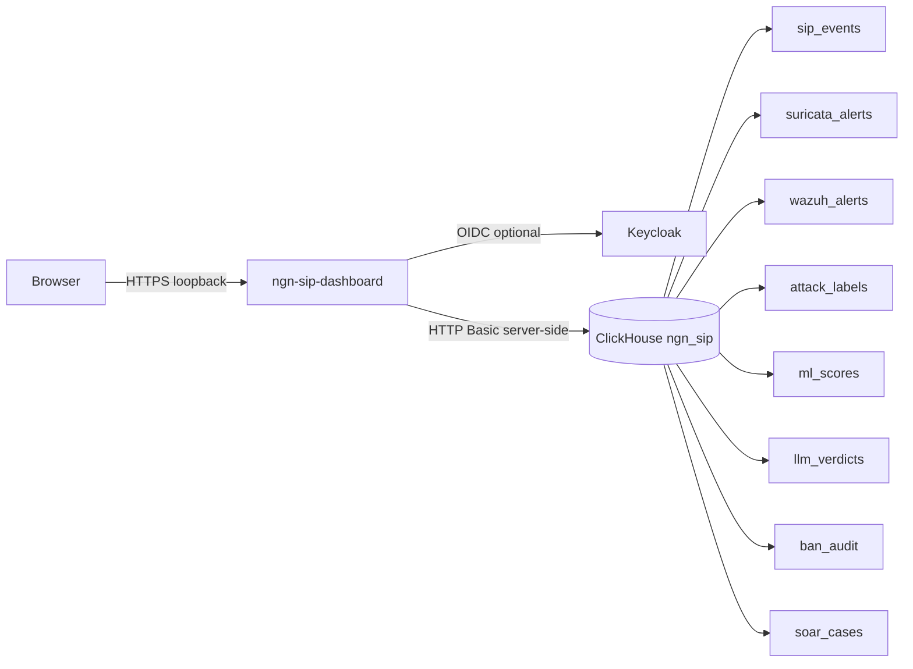

# NGN SIP Stack Dashboard

Single-pane monitoring for the NGN SIP attack-detect-defend lab. The dashboard reads ClickHouse on the server side, renders SIP QoS and security pipeline panels in a dark Next.js UI, and binds to loopback only (SSH tunnel access).

## Architecture



Design goals:

- Browser never talks to ClickHouse directly.
- All SQL runs in `app/api/metrics/route.ts` via fixed query templates and ClickHouse `{param:Type}` bindings.
- Layout is client-side (`react-grid-layout`) with localStorage persistence and JSON template export/import.
- Stack health is approximated from table freshness (no Docker socket access from the browser or dashboard container).

## Build and run

Prerequisites:

1. Main lab network exists: `ngn-sip_sip_lab` (from `docker compose up` on the core stack).
2. ClickHouse is healthy:
   `docker compose -f docker-compose.observability.yml up -d clickhouse`

Build and start the dashboard:

```bash
# From repo root; reuse CLICKHOUSE_* from .env
export CLICKHOUSE_PASSWORD="${CLICKHOUSE_PASSWORD:-change-me-local-only}"
docker compose -f docker-compose.dashboard.yml up -d --build
```

Local dev (without Docker):

```bash
cd dashboard
cp .env.example .env
# Set CLICKHOUSE_URL=http://127.0.0.1:8123 if ClickHouse is port-forwarded
npm install
npm run dev
# Open http://127.0.0.1:3000
```

Access on the campus VM (loopback only):

```bash
# On VM: dashboard listens on 127.0.0.1:3002
ssh -L 3002:127.0.0.1:3002 user@campus-vm
# Open http://127.0.0.1:3002
```

Health check:

```bash
curl -s http://127.0.0.1:3002/api/health | jq .
```

## Environment variables

| Variable | Required | Default | Purpose |
|---|---|---|---|
| `CLICKHOUSE_URL` | yes (runtime) | `http://clickhouse:8123` | ClickHouse HTTP endpoint (server-side only) |
| `CLICKHOUSE_USER` | yes | `ngn` | ClickHouse user |
| `CLICKHOUSE_PASSWORD` | yes | (none) | ClickHouse password from `.env`, never commit |
| `CLICKHOUSE_DATABASE` | no | `ngn_sip` | Database name |
| `KEYCLOAK_ISSUER` | no | empty | Server-side issuer for discovery, token, userinfo, JWKS (e.g. `http://keycloak:8080/realms/ngn-sip-lab`) |
| `KEYCLOAK_BROWSER_AUTH_URL` | if tunnel | derived from issuer | Browser-facing authorization endpoint (e.g. `http://localhost:8080/realms/ngn-sip-lab/protocol/openid-connect/auth`) |
| `KEYCLOAK_CLIENT_ID` | if OIDC | `ngn-sip-dashboard` | Keycloak client ID |
| `KEYCLOAK_CLIENT_SECRET` | if OIDC | (none) | Client secret from Keycloak admin |
| `NEXTAUTH_URL` | if OIDC | `http://127.0.0.1:3002` | Public URL of the dashboard (browser-facing) |
| `NEXTAUTH_SECRET` | if OIDC | (none) | Session encryption secret |
| `DASHBOARD_ALLOW_INSECURE` | no | (unset) | Set to `true` for loopback-only dev without OIDC; otherwise auth is required |
| `DASHBOARD_REFRESH_MS` | no | `15000` | Panel auto-refresh interval |
| `DEV_BIND_IP` | no | `127.0.0.1` | Host bind address in compose |

Copy `dashboard/.env.example` for local runs. Docker compose reads the same names from the repo root `.env`.

## Keycloak client setup

The realm `ngn-sip-lab` is defined in `identity/keycloak/realm-export.json`. The dashboard client is **not** in that export yet; create it before enabling OIDC:

1. Keycloak admin: `http://127.0.0.1:8080` (realm `ngn-sip-lab`).
2. Clients → Create client:
   - Client ID: `ngn-sip-dashboard`
   - Client authentication: ON
   - Standard flow: ON
   - Valid redirect URIs: `http://127.0.0.1:3002/api/auth/callback/keycloak`, `http://localhost:3002/api/auth/callback/keycloak`
   - Web origins: `http://127.0.0.1:3002`, `http://localhost:3002`
3. Copy the client secret into `KEYCLOAK_CLIENT_SECRET`.
4. Set in compose or `.env`:
   - `KEYCLOAK_ISSUER=http://keycloak:8080/realms/ngn-sip-lab` (server-side token URL)
   - `NEXTAUTH_URL=http://127.0.0.1:3002` (browser-facing)
   - `NEXTAUTH_SECRET=<random>`

The dashboard **fails closed** unless OIDC is fully configured (`KEYCLOAK_ISSUER` and a non-default `NEXTAUTH_SECRET`) or you explicitly opt into insecure local dev with `DASHBOARD_ALLOW_INSECURE=true`. Any exposure beyond loopback requires real Keycloak configuration; do not rely on bind address alone. Loopback-only development may set `DASHBOARD_ALLOW_INSECURE=true` to skip the login gate. The Docker image still builds without Keycloak present.

## Keycloak SSO (behind SSH tunnel)

Split-horizon OIDC: the dashboard container talks to Keycloak on the Docker network (`keycloak:8080`); your browser reaches Keycloak through a local port forward (`localhost:8080`). Tunnel **both** ports before signing in:

```bash
ssh -L 3002:127.0.0.1:3002 -L 8080:127.0.0.1:8080 user@campus-vm
```

Required environment (compose or `.env`):

```bash
KEYCLOAK_ISSUER=http://keycloak:8080/realms/ngn-sip-lab
KEYCLOAK_BROWSER_AUTH_URL=http://localhost:8080/realms/ngn-sip-lab/protocol/openid-connect/auth
KEYCLOAK_CLIENT_ID=ngn-sip-dashboard
KEYCLOAK_CLIENT_SECRET=<from Keycloak admin>
NEXTAUTH_SECRET=<random>
NEXTAUTH_URL=http://localhost:3002
DASHBOARD_ALLOW_INSECURE=false
```

`KEYCLOAK_ISSUER` drives server-side OIDC discovery, token exchange, userinfo, and JWKS validation against `keycloak:8080`. `KEYCLOAK_BROWSER_AUTH_URL` overrides only the authorization redirect so the login page loads in the browser via the tunnel.

For real exposure (no SSH tunnel), use a single public HTTPS host for both values: set `KEYCLOAK_ISSUER` to the public realm URL and omit `KEYCLOAK_BROWSER_AUTH_URL` (next-auth derives the authorization endpoint from the issuer). See also `docs/sso/keycloak_architecture.md`.

## URL query parameters

| Param | Example | Effect |
|---|---|---|
| `layout` | `?layout=security` | Load built-in preset (`default`, `security`, `sip`) |
| `panels` | `?panels=sip-responses,top-sources` | Show only listed panels |
| `hide-chrome` | `?hide-chrome=1` | Hide sidebar and layout toolbar (kiosk / embed) |

Examples:

- `http://127.0.0.1:3002/?layout=security`
- `http://127.0.0.1:3002/?panels=attack-timeline,ban-audit&hide-chrome=1`

## Panel catalogue

| Panel ID | Title | ClickHouse source | Notes |
|---|---|---|---|
| `stack-health` | Stack Health | Multiple tables (freshness) | Approximation; see below |
| `c3-summary` | C3 Detector Comparison | (static) | Cites `docs/results/RESULTS_stage1_grouped.md` |
| `sip-responses` | SIP Responses | `sip_events` | Pie: method / response mix |
| `top-sources` | Top Source IPs | `sip_events`, `suricata_alerts`, `attack_labels`, `ban_audit` | Flags MITRE labels and bans |
| `cdr-grid` | CDR / QoS Grid | `sip_events` | QoS columns pending HEP RTCP |
| `register-chart` | REGISTER Activity | `sip_events` (`method=REGISTER`) | Success vs 401/403 |
| `suricata-rate` | Suricata Alert Rate | `suricata_alerts` | 5-minute buckets |
| `wazuh-sip` | Wazuh SIP Rules | `wazuh_alerts` | `rule_id` 100100..100199 |
| `ml-scores` | Stage 1 ML Verdicts | `ml_scores` | `predicted_class`, `proba` over time |
| `llm-verdicts` | Stage 2 LLM Verdicts | `llm_verdicts` | Advisory triage |
| `ban-audit` | Autoban Actions | `ban_audit` | Tallies; `ban_table` not queried |
| `soar-cases` | SOAR Cases | `soar_cases` | Manual DDL if table absent |
| `attack-timeline` | Attack Timeline | `attack_labels`, `ban_audit` | Ground truth + defend actions |

## MOS, Loss, Delay (QoS columns)

Homer / HEPlify RTCP quality metrics (MOS, packet loss, delay) are **not** in ClickHouse today. Current `sip_events` rows come mainly from Suricata SIP EVE (`source=suricata`) with minimal fields; full response codes and RTCP require Kamailio HEP capture (see `docs/security/homer_design.md`).

The CDR panel shows call/response counts now and labels MOS / Loss / Delay as **pending HEP data**. When RTCP is ingested into a future table or materialized view, wire the API query in `dashboard/lib/queries.ts` and set `qos_available: true` in the metrics handler.

## Stack health approximation

The dashboard cannot reach the Docker socket or container health endpoints from the browser. The **Stack Health** panel infers status from ClickHouse:

- **healthy**: latest row within 25% of the selected time window
- **stale**: rows exist but older
- **empty**: zero rows in window
- **unknown**: no telemetry path (Kamailio, rtpengine, Grafana, Keycloak as external)

Proxies:

- **Ollama**: `llm_verdicts` freshness
- **Shuffle**: `soar_cases` freshness
- **Suricata SIP path**: `sip_events` grouped by `source`

This is intentional for a read-only monitoring tier; do not treat it as a substitute for `docker ps` or Prometheus probes.

## Security notes

- **Loopback bind**: compose publishes `${DEV_BIND_IP:-127.0.0.1}:3002:3000`. Reach via SSH tunnel, not public exposure.
- **Server-side queries**: ClickHouse credentials exist only in the dashboard container environment.
- **Parameterised SQL**: user input is limited to bounded `hours`, `limit`, and `groupBy` enum; no string concatenation of raw user SQL.
- **OIDC**: enable Keycloak for shared lab hosts; rotate `NEXTAUTH_SECRET` and client secrets per `docs/security/oauth_hardening_checklist.md`.
- **Container hardening**: `cap_drop: ALL`, `no-new-privileges`, read-only rootfs, memory/CPU limits (see `docker-compose.dashboard.yml`).

## Layout persistence

- Current grid: `localStorage` key `ngn-sip-dashboard-layout`
- Named templates: `ngn-sip-dashboard-layout-templates`
- Lock state: `ngn-sip-dashboard-layout-locked`
- Export/import: JSON via toolbar (schema in `dashboard/types/layout.ts`)

Built-in presets: `default`, `security`, `sip` (see `dashboard/lib/panels.ts`).

## Status and known gaps

The dashboard is built and type-checks: Next.js 15 with a dark UI, `react-grid-layout` (drag/resize, lock, template save/load/export), the parameterized ClickHouse metrics API, next-auth Keycloak, and a hardened multi-stage Dockerfile. Known gaps before it is production-ready:

- End-to-end runtime verification on the campus VM, and the `ngn-sip-dashboard` Keycloak client in the realm export.
- QoS columns (MOS/Loss/Delay) await HEP RTCP ingest into ClickHouse; the CDR panel labels them pending.
- Panel tests + a CI job, server-side rate limiting on `/api/metrics`, and mobile layout polish.
- `ml_scores` column-name alignment if the campus scorer uses `score_time` vs the assumed `scored_at`.

## Related docs

- `docs/09_soar_runbook.md` (ban_audit, soar_cases DDL)
- `docs/results/RESULTS_stage1_grouped.md` (ML headline metrics)
- `docs/sso/keycloak_architecture.md` (OIDC URL split)
- `docs/security/homer_design.md` (HEP / QoS path)
