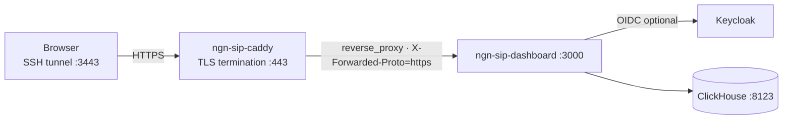

# HTTPS reverse proxy (Caddy)

Terminate TLS in front of the NGN SIP stack dashboard so the Next.js app is reachable over HTTPS. Caddy sits on the `ngn-sip_sip_lab` Docker network and reverse-proxies to `ngn-sip-dashboard:3000`.

Two operator modes:

| Mode | TLS | How you reach it |
|------|-----|------------------|
| DEV/TUNNEL (now) | Caddy `tls internal` (self-signed) | SSH tunnel to loopback port 3443 |
| EXPOSURE (later) | Let's Encrypt (automatic) | Public hostname on port 443 |

Management planes (Grafana, Keycloak admin, Wazuh, ClickHouse, and so on) stay on loopback unless you deliberately expose them separately.

## Architecture



## Prerequisites

1. Lab network exists: `ngn-sip_sip_lab` (core stack).
2. Dashboard is running and healthy:
   `docker compose -f docker-compose.dashboard.yml up -d --build`

## DEV/TUNNEL mode (self-signed, SSH tunnel)

### Start the proxy

From the repo root on the VM:

```bash
docker compose --env-file .env -f docker-compose.proxy.yml up -d
```

Defaults (override in `.env` if needed):

- `SITE_ADDRESS=:443` (listen inside the container)
- `DASHBOARD_UPSTREAM=ngn-sip-dashboard:3000`
- Host bind: `${DEV_BIND_IP:-127.0.0.1}:3443` -> container `443`

### Tunnel and open the UI

On your laptop:

```bash
ssh -L 3443:127.0.0.1:3443 user@campus-vm
```

Open `https://localhost:3443`. The browser will warn about the self-signed certificate; accept it for the lab tunnel demo.

### Health check

```bash
docker compose -f docker-compose.proxy.yml ps
curl -k https://127.0.0.1:3443/api/health
```

## Integration with next-auth and Keycloak

When you front the dashboard with HTTPS, you must align the auth callback URLs. Do not change application code; update VM `.env` and Keycloak client settings, then redeploy the dashboard.

### Why

next-auth builds its OAuth redirect and callback URLs from `NEXTAUTH_URL`, so it must match what the browser actually uses. Caddy sets `X-Forwarded-Proto: https` automatically, so through the proxy the app sees HTTPS; if `NEXTAUTH_URL` still points at the old `http://127.0.0.1:3002`, Keycloak rejects the flow.

### DEV/TUNNEL settings

On the VM `.env`:

```bash
NEXTAUTH_URL=https://localhost:3443
```

In Keycloak (realm `ngn-sip-lab`, client `ngn-sip-dashboard`), add this redirect URI:

```text
https://localhost:3443/api/auth/callback/keycloak
```

Redeploy the dashboard so it picks up the new env:

```bash
docker compose -f docker-compose.dashboard.yml up -d --build
```

Keep `DASHBOARD_ALLOW_INSECURE=true` only for loopback demos without Keycloak. For OIDC through the proxy, set `DASHBOARD_ALLOW_INSECURE=false`, provide `KEYCLOAK_ISSUER` and a real `NEXTAUTH_SECRET`, and tunnel Keycloak (`8080`) if the issuer uses `http://localhost:8080`.

## EXPOSURE mode (Let's Encrypt, public hostname)

Use this when the dashboard should be reachable on a real campus or public hostname.

### Caddy configuration

1. Set `SITE_ADDRESS` to the public hostname, for example `dashboard.lab.example.ac.uk`.
2. Edit `caddy/Caddyfile`: remove the `tls internal` line. Caddy will obtain and renew a Let's Encrypt certificate automatically (stored in the `caddy_data` volume).
3. Uncomment the `Strict-Transport-Security` header in the `header` block.

Example `.env` overrides:

```bash
SITE_ADDRESS=dashboard.lab.example.ac.uk
```

### Network and firewall

- Publish Caddy on port 443 at the campus edge (adjust `docker-compose.proxy.yml` port mapping or front it with campus load balancing as your site requires).
- Open TCP 443 on the campus firewall to the VM or load balancer serving Caddy.
- Leave other management UIs on loopback (`DEV_BIND_IP=127.0.0.1`) unless you have a separate exposure plan for each.

### Auth URLs for exposure

On the VM `.env`:

```bash
NEXTAUTH_URL=https://dashboard.lab.example.ac.uk
```

In Keycloak, set the `ngn-sip-dashboard` client redirect URI to:

```text
https://dashboard.lab.example.ac.uk/api/auth/callback/keycloak
```

Redeploy the dashboard after changing `.env`.

Keycloak itself can remain loopback-only; operators reach it via SSH tunnel. Only the dashboard public URL and matching redirect URI need to change for browser OIDC through HTTPS.

## Files

| File | Role |
|------|------|
| `caddy/Caddyfile` | Site block, TLS mode, security headers, upstream |
| `docker-compose.proxy.yml` | `ngn-sip-caddy` service, volumes, hardening |
| `docs/13_https_reverse_proxy.md` | This runbook |

## Stop

```bash
docker compose -f docker-compose.proxy.yml down
```

Certificates in `caddy_data` persist across restarts. Use `docker compose -f docker-compose.proxy.yml down -v` only if you intend to wipe Caddy state.
