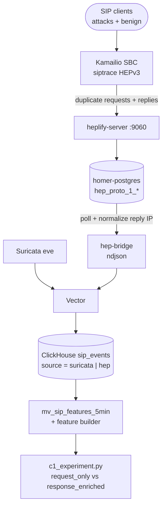

# C1 HEP Response-Level Features

Contribution **C1** (headline): quantify detection lift when Stage 1 ML uses
response-level SIP telemetry (401/404/486/487/408, auth-failure ratios) in
addition to request-level Suricata features.

Implementation status: **deployable code committed**; end-to-end verification
requires live SIP traffic on the campus VM (see [Validation boundary](#validation-boundary)).

---

## Architecture



### Why hep-bridge + Vector (not Vector -> Postgres directly)

| Option | Verdict |
|--------|---------|
| Vector Postgres source | Not available in Vector 0.41 with incremental cursors |
| heplify -> Loki/HTTP | Extra moving part; Postgres is already the Homer store |
| **hep-bridge -> ndjson -> Vector** | Reuses the existing ClickHouse sink; `source` discriminates rows; bridge handles rotated `hep_proto_1_*` tables and reply IP normalization |

---

## Enable HEP capture on Kamailio

1. Ensure Homer stack is up (`heplify-server` reachable as `heplify-server:9060` on `ngn-sip_sip_lab`).
2. HEP is **on by default** via `#!define HEP_CAPTURE_ENABLE` in `infra/kamailio/kamailio.cfg`.
3. To disable without removing files, comment out that define and recreate Kamailio:

```bash
# in infra/kamailio/kamailio.cfg, comment:
# #!define HEP_CAPTURE_ENABLE

docker compose up -d --force-recreate kamailio
```

4. Module details: `infra/kamailio/modules/siptrace.cfg` (HEPv3, capture_id=10, all requests/replies except OPTIONS keepalive).

---

## Bring up the bridge

From repo root on the VM (sip_lab network must exist from core stack):

```bash
# 1) Homer + bridge
docker compose -f docker-compose.homer.yml up -d --build

# 2) Recreate Vector to mount hep_bridge_logs volume
docker compose -f docker-compose.observability.yml up -d --force-recreate vector

# 3) Recreate Kamailio if you changed HEP settings
docker compose up -d --force-recreate kamailio
```

Sanity queries (ClickHouse HTTP on loopback):

```sql
SELECT * FROM ngn_sip.sip_events_by_source;
SELECT response_code, response_phrase, source, cnt
FROM ngn_sip.sip_response_codes
WHERE response_code IN (200, 401, 404, 407, 486, 487)
ORDER BY cnt DESC
LIMIT 20;
```

Homer UI (forensic check): `http://127.0.0.1:9080` (after SSH tunnel).

---

## Run the C1 before/after experiment

Prerequisites:

- Labeled attack matrix rows in `ngn_sip.attack_labels`
- `ngn_sip.sip_events` contains **both** `source='suricata'` and `source='hep'`
- HEP rows with `response_code > 0` (credential scans should produce 401/407)

On the VM (ClickHouse native port is internal; run from sip_lab network):

```bash
cd ml/stage1
python3 -m venv .venv && . .venv/bin/activate
pip install -e .

export CLICKHOUSE_HOST=clickhouse CLICKHOUSE_PORT=9000
export CLICKHOUSE_USER=ngn CLICKHOUSE_PASSWORD='${CLICKHOUSE_PASSWORD}'

python ../c1_experiment.py \
  --since-hours 336 \
  --detector xgboost \
  --cv-splits 5 \
  --no-synthetic-fallback \
  --output-dir ../results
```

Outputs:

- `ml/results/c1_comparison_YYYY-MM-DD.json` (full payload)
- `ml/results/c1_comparison_YYYY-MM-DD.csv` (per-class + macro table)
- `ml/results/RESULTS_c1_hep_YYYY-MM-DD.md` (paper-ready summary)

### Interpretation

| Arm | Feature set | Features | Expectation |
|-----|-------------|----------|-------------|
| A | `request_only` | 16 | Matches pre-HEP Suricata-era baseline (no response-code dependence) |
| B | `response_enriched` | 31 | Adds auth-4xx ratio, 404 counts, response/request ratio, and related response signals |

Report **macro F1 with bootstrap 95% CI** and per-class F1 delta (B - A). Credential-class recall should rise when 401/407 responses are captured; if HEP coverage is zero, arms collapse to the same signal and delta ~ 0 (report as failed precondition, not a negative result).

Protocol matches `docs/results/RESULTS_stage1_grouped.md`: `StratifiedGroupKFold` grouped by `src_ip`, bootstrap 2000 resamples on pooled OOF predictions.

---

## Feature contract (#54)

Defined in `ml/stage1/features.py`:

- `request_only`: 16 request-side features
- `response_enriched`: 31 features (request + response-level)
- `legacy_full`: original 22-feature contract (unchanged default for existing scorer)

Response-enriched features require aggregation from `sip_events` (not `sip_features_5min` alone) because the materialized view does not yet include 404/486/487/408 breakdowns.

---

## Validation boundary

**Statically verified in repo:**

- `vector validate --no-environment observability/vector/vector.yaml`
- `docker compose -f docker-compose.homer.yml config`
- `pytest ml/tests/test_c1_features.py ml/tests/test_hep_bridge.py`
- SQL init files parse (ClickHouse DDL)

**Requires live VM testing:**

- Kamailio `siptrace.so` loads in the running image (`kamailio-extra-modules` package)
- HEP packets arrive at heplify (Homer search shows Call-IDs)
- Bridge emits ndjson; Vector ingests `source='hep'` rows
- `response_code > 0` after labeled credential/recon runs
- C1 experiment delta with real (non-synthetic) windows

---

## Related docs

- `docs/security/homer_design.md` (Homer stack design)
- `infra/kamailio/modules/siptrace.cfg` (capture config)
- `observability/hep-bridge/bridge.py` (Postgres poll + normalization)
