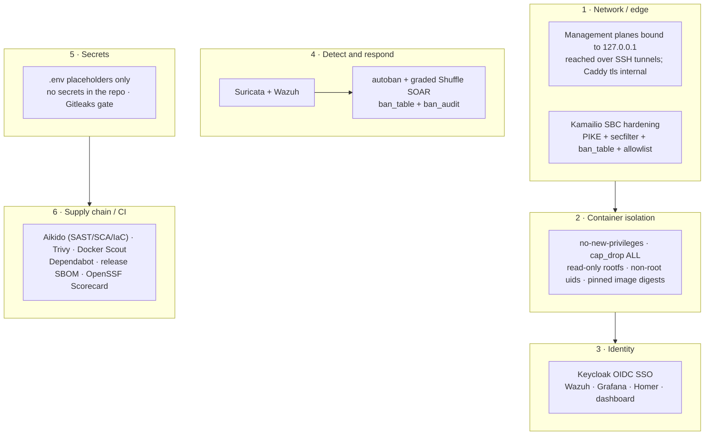

# Security

Defense-in-depth notes for the stack: edge hardening, container isolation,
identity, detection-and-response, secrets, and the supply-chain/CI gates.

## Security architecture (defense in depth)

## Contents

| Document | Covers |
|---|---|
| [`control_mapping.md`](control_mapping.md) | Hardening commits mapped to CIS / BSI IT-Grundschutz controls |
| [`sbc_hardening_runbook.md`](sbc_hardening_runbook.md) | Kamailio SBC hardening and enablement steps |
| [`oauth_hardening_checklist.md`](oauth_hardening_checklist.md) | OAuth 2.0 / OIDC hardening against the current Keycloak setup |
| [`keycloak_oidc.md`](keycloak_oidc.md) | Keycloak OIDC design for the SOC tools |
| [`wazuh_4.14_tls_setup.md`](wazuh_4.14_tls_setup.md) | Wazuh indexer TLS + security-plugin configuration |
| [`suricata_design.md`](suricata_design.md) | Suricata IDS design and rule posture |
| [`homer_design.md`](homer_design.md) | Homer / HEP capture design |
| [`local_development_exposure.md`](local_development_exposure.md) | Loopback-only local-development policy |
| [`container_security_automation.md`](container_security_automation.md) | The CI/local vulnerability-gate stack (Aikido, Trivy, Docker Scout) and its boundary with Wazuh/Shuffle |
| [`scout_triage_README.md`](scout_triage_README.md) | Docker Scout CVE-triage pipeline |
| [`docker_image_review.md`](docker_image_review.md) | Docker Scout image findings and remediation notes |
| [`asterisk_advisory_review.md`](asterisk_advisory_review.md) | Asterisk advisories mapped to the build and runtime posture |

Before exposing anything beyond loopback, follow
[`../INTERNET_EXPOSURE.md`](../INTERNET_EXPOSURE.md).
