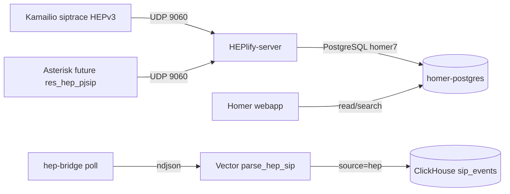

# Homer 7 SIP capture design

## Scope

This scaffold adds a local-only Homer capture plane for SIP dialog reconstruction and per-call forensics. It is intentionally separate from the core SIP PostgreSQL instance so the subscriber schema, pgvector RAG schema, and Homer SIPCAPTURE tables do not collide.

The stack is defined in `docker-compose.homer.yml`:

- `homer-postgres`: dedicated PostgreSQL 15 data store for `homer_data` and `homer_config`.
- `heplify-server`: HEPv3 UDP collector on `9060/udp`, PostgreSQL writer, and internal Prometheus metrics on `9090/tcp`.
- `homer-webapp`: Homer UI/API on container port `80`, published locally as `${DEV_BIND_IP:-127.0.0.1}:9080`.

The only host-published ports are loopback-scoped:

- `${DEV_BIND_IP:-127.0.0.1}:9060/udp` for HEP from local Kamailio/Asterisk containers.
- `${DEV_BIND_IP:-127.0.0.1}:9080/tcp` for the Homer UI.

PostgreSQL and HEPlify Prometheus metrics stay on the internal `ngn-sip_sip_lab` network.

## Image pinning note

`postgres:15.10` was verified with `docker manifest inspect`.

The requested `sipcapture/heplify-server:1.65.13` and `sipcapture/webapp:7.10.7` tags were not present in Docker Hub at the time of writing. The compose file therefore uses immutable digest references for the currently published SIPCAPTURE Docker Hub artifacts:

- `sipcapture/heplify-server@sha256:ab0cfcc929d0844a889ed1c16662e0a3fe120aaa974909970acd54da5a76e043`
- `sipcapture/webapp@sha256:e34fa9a3461e6cad693a2503fb569bff952f91a4fc49e8fc0f0d5cf4c10e850b`

This preserves the project rule of no floating `latest` tags while making the upstream tag gap explicit.

## Data flow



HEPlify-server is configured for Homer 7/PostgreSQL, 14-day retention, SIP payload filtering, deduplication, and Docker stdout logging. The seeded schema creates the base `hep_proto_*` tables that Homer mapping queries expect; HEPlify-server can still create time-partitioned/rotated tables at runtime.

## Kamailio integration (implemented)

`infra/kamailio/modules/siptrace.cfg` is included from `kamailio.cfg` when
`HEP_CAPTURE_ENABLE` is defined. It loads `siptrace.so`, sends HEPv3 to
`sip:heplify-server:9060;transport=hep`, and mirrors requests and replies via
`sip_trace()` in `request_route` and `onreply_route`.

Disable by commenting `#!define HEP_CAPTURE_ENABLE` in `kamailio.cfg`. See
`docs/C1_HEP_RESPONSE_FEATURES.md` for the full C1 data path.

## Asterisk integration plan

No Asterisk config is changed in this commit. Current `infra/asterisk/etc/modules.conf` explicitly unloads `res_hep.so`, `res_hep_pjsip.so`, and `res_hep_rtcp.so`, so Asterisk HEP export is not active yet.

Future Asterisk work:

1. Remove the `noload` lines for the HEP modules once the image is confirmed to include them.
2. Add `hep.conf` or the Asterisk 20 equivalent with:
   - collector host: `heplify-server`
   - collector port: `9060`
   - transport: UDP
   - capture ID: a stable Asterisk ID, for example `20`
3. Enable PJSIP session logging only for the lab profile so SIP messages are exported to Homer without turning production-like logs noisy.
4. Keep RTP/RTCP HEP export separate from SIP until the RTP privacy/SRTP demo has its own consent and retention notes.

The intended forensic result is one Homer dialog where Kamailio and Asterisk legs can be compared by Call-ID, source/destination, method, status, and timing.

## Auth and OIDC

The initial webapp config stays on internal auth with local-only defaults:

- user: `admin`
- password default: `change-me-local-only`

The Keycloak integration is intentionally a TODO. It should reuse the local realm pattern in `docs/security/keycloak_oidc.md` after Homer internal auth and DB migrations are smoke-tested. Do not expose Homer beyond loopback until OIDC, TLS, and VM firewall controls are in place.

## MITRE false-positive scenarios

| Scenario | Likely mapping | Why it can false-positive | Homer evidence to check |
|---|---|---|---|
| SIP OPTIONS keepalive burst from the proxy or monitoring job | T1046 Network Service Discovery | OPTIONS floods can look like recon when rate-only rules ignore source role. | Confirm method is OPTIONS, source is a known lab node, dialog has no credential attempts, and timing matches health checks. |
| Repeated REGISTER failures from a misconfigured UA | T1110 Brute Force | A wrong password or stale nonce can resemble password guessing. | Compare Contact/User-Agent consistency, single source IP, monotonic CSeq, and absence of extension enumeration. |
| SIPp load test before a demo | T1498 Network Denial of Service | Synthetic call-rate tests can hit volume thresholds. | Check User-Agent/SIPp markers, planned test window, and complete call setup/teardown rather than malformed traffic. |
| NAT rebinding or Docker restart changes source port | T1090 Proxy or T1584 Infrastructure patterns by weak heuristics | Port churn may be mistaken for proxy hopping or distributed activity. | Use Homer call-flow timing and Via/Contact headers to distinguish one UA from many origins. |
| Malformed SIP torture cases from RFC 4475 tests | T1190 Exploit Public-Facing Application | Parser stress tests can look like exploit traffic. | Confirm the source is the attack harness, correlate to the labeled test run, and inspect raw payload for known torture corpus signatures. |

These scenarios should feed the Wazuh/Suricata tuning loop: Homer gives packet-level context, while ClickHouse and Wazuh provide rate and alert history.

## Validation boundary

This commit only validates Compose rendering:

```bash
docker compose -f docker-compose.homer.yml --env-file .env config --quiet
```

It does not bring Homer up locally. Homer can add roughly 3 GiB of memory pressure and should be smoke-tested separately after Wazuh/SOAR are stopped or Docker Desktop memory is raised.
