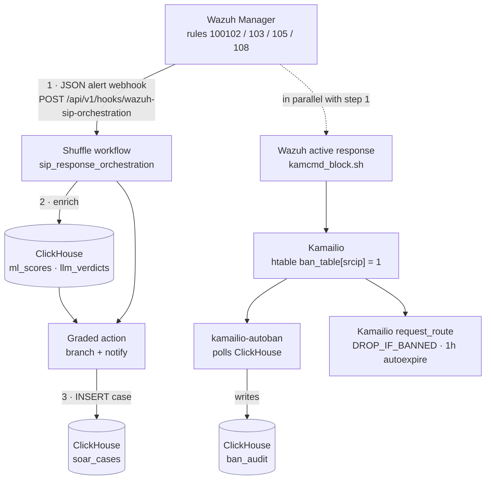

# SOAR pipeline (Wazuh -> Shuffle -> ClickHouse)

End-to-end alert flow once Wazuh + Shuffle are up on `sip_lab`.
All stacks are loopback-only; no service is reachable outside the host.
Case and verdict records live in ClickHouse (`soar_cases`, `llm_verdicts`, `ban_audit`).

## Flow



The integration block is installed once into `ossec.conf` by
`install_integrations.sh` (step 0), which is what lets the manager post to the
webhook.

## Components and ownership

| Stack | Compose file | Up target | Memory | Bind |
| --- | --- | --- | --- | --- |
| Core SIP | `docker-compose.yml` | `make up` | ~1.5 GiB | 5060/UDP, 30000-30100/UDP |
| Observability | `docker-compose.observability.yml` | `make obs-up` | ~1.5 GiB | 8123, 3000 |
| Wazuh SIEM | `docker-compose.wazuh.yml` | `make wazuh-up` | ~5 GiB | 1514, 1515, 5601, 55000 |
| Shuffle SOAR | `docker-compose.soar.yml` | `make soar-up` | ~2.5 GiB | 3001, 5001 |
| ML | `docker-compose.ml.yml` | `make ml-up` | ~1 GiB idle, +5 GiB on inference | 11434 |

Total when everything is up: ~11.5 GiB memory ceiling. **Docker Desktop must be at >=16 GiB** to run the full pipeline comfortably; the lab default of 12 GiB covers core+wazuh+observability.

## One-time integration install

After both Wazuh and Shuffle are healthy, install the integration block:

```bash
make wazuh-up
make soar-up
make wazuh-integrate            # idempotent; restarts wazuh-manager
```

Verify the block is in place:

```bash
make wazuh-integrate-dryrun     # prints resulting ossec.conf without writing
```

Remove (e.g., to swap webhook URL):

```bash
make wazuh-integrate-remove
```

The installer is `siem/wazuh/integrations/install_integrations.sh`. It uses the Wazuh API (`/manager/files`, `/manager/restart`) under JWT auth and brackets the integration block with sentinel comments for idempotent re-runs.

## Ports table (loopback only)

| Service | Bind | Purpose |
| --- | --- | --- |
| Wazuh dashboard | `127.0.0.1:5601` | Wazuh UI |
| Wazuh API | `127.0.0.1:55000` | manager API (used by installer) |
| Wazuh agent | `127.0.0.1:1514-1515` | agent enrollment/comms (none in this lab yet) |
| Shuffle UI | `127.0.0.1:3001` | workflow editor |
| Shuffle API/webhook | `127.0.0.1:5001` | inbound webhook from Wazuh |
| ClickHouse HTTP | `127.0.0.1:8123` | case and audit store |

## Bootstrapping checklist (first run)

1. Bring up stacks in order: core -> observability -> wazuh -> soar.
2. **Shuffle**: open `http://127.0.0.1:3001`, complete first-run setup. Import `soar/shuffle/workflows/sip_response_orchestration.json` and bind it to the `wazuh-sip-orchestration` webhook trigger.
3. Create `ngn_sip.soar_cases` in ClickHouse (DDL in `docs/09_soar_runbook.md`).
4. Run `make wazuh-integrate` to wire the Wazuh integration block (repoint hook URL to the orchestration path).
5. Smoke-test: replay a brute-force log line via `wazuh-logtest`; observe a Shuffle execution, a `soar_cases` row, and (on the ban branch) a Kamailio `kamcmd htable.dump ban_table` entry or matching `ban_audit` row.

## Hardening debt (close before any non-loopback exposure)

- Wazuh indexer security plugin disabled (`siem/wazuh/indexer/opensearch-local.yml`); replace with TLS + Keycloak OIDC.
- Shuffle OpenSearch security disabled (`docker-compose.soar.yml`).
- Shuffle `SHUFFLE_DEFAULT_PASSWORD`, `SHUFFLE_DEFAULT_APIKEY`, `SHUFFLE_ENCRYPTION_MODIFIER` are placeholders; rotate via `.env`.
- All deployment to the TH Köln campus VM stays behind ingress + mTLS; no UI port is ever published outside loopback in dev.
