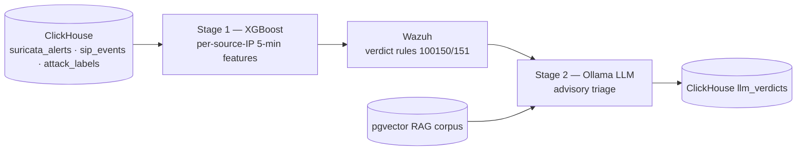

# Machine Learning

The two-stage ML triage path: a Stage-1 classifier that scores behaviour, and a
Stage-2 LLM that writes advisory verdicts. This README is the entry point; each
stage has its own detail.

## Components

- **[`stage1/`](stage1/README.md)** — the XGBoost + IsolationForest classifier. Reads ClickHouse features, trains under leakage-free source-IP-grouped CV, and writes the model. Headline: binary F1 0.75 (grouped), versus a leaky 0.988 under naive splitting.
- **[`stage2/`](stage2/README.md)** — the Ollama LLM triage worker. Consumes Wazuh alerts, calls the local model with RAG context, and writes schema-validated verdicts to `ngn_sip.llm_verdicts`. Reported honestly as advisory and latency-bound.
- **[`rag/`](rag/README.md)** — the retrieval corpus (MITRE ATT&CK, SIP RFCs, NVD VoIP CVEs) embedded into pgvector for Stage-2 prompt context.
- **[`deploy/`](deploy/README.md)** — the runtime scoring bundle (the Stage-1 online scorer as deployed).
- **[`src/`](src/README.md)** — the three-arm comparison evaluation harness.
- **[`mlflow/`](mlflow/README.md)** — experiment tracking for the runs above.

## Results

See [`results/`](results/) and [`../docs/results/`](../docs/results/) for the
pinned metrics, and [`../docs/06_evaluation_methodology.md`](../docs/06_evaluation_methodology.md)
for the evaluation protocol.
