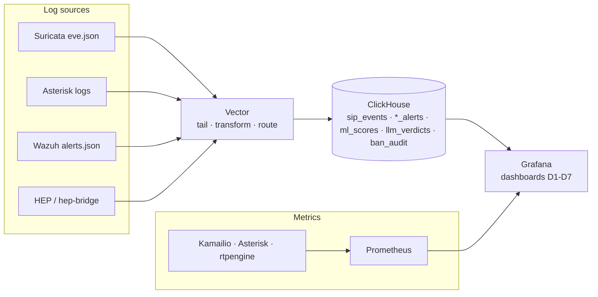

# Observability

Metrics, logs, and the evidence store for the SIP lab. Runs from
[`../docker-compose.observability.yml`](../docker-compose.observability.yml) on
the shared `ngn-sip_sip_lab` bridge; host ports stay loopback-only via
`DEV_BIND_IP`.



## Services

- **[`vector/`](vector/)** — tails Suricata `eve.json`, Asterisk logs, Wazuh alerts, and HEP rows, normalizes them, and writes to ClickHouse.
- **`clickhouse`** ([`../infra/clickhouse/`](../infra/clickhouse/)) — the OLAP evidence store for raw logs, SIP events, ML feature windows, and verdicts.
- **[`grafana/`](grafana/)** — provisioned ClickHouse + Prometheus datasources and the D1-D7 dashboards.
- **[`prometheus/`](prometheus/)** — scrapes Kamailio, Asterisk, rtpengine, and itself.

## Run

```sh
make obs-up
make obs-smoke
```

Endpoints (loopback): ClickHouse `http://127.0.0.1:8123`, Grafana
`http://127.0.0.1:3000`, Prometheus `http://127.0.0.1:9090`.
