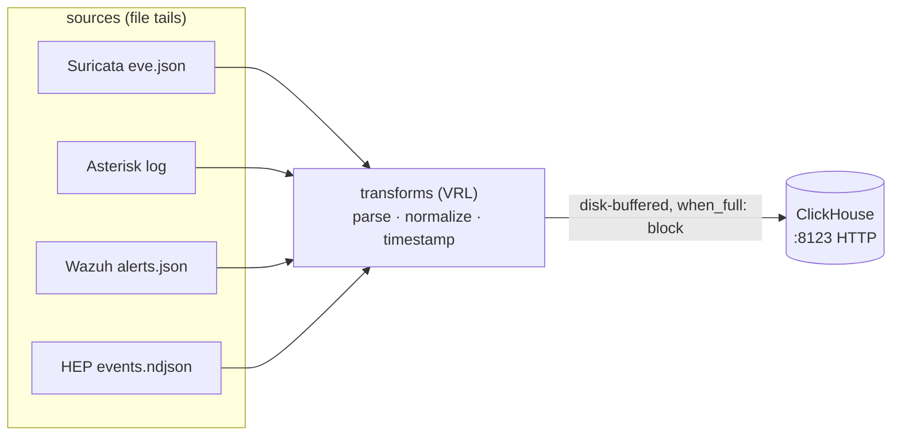

# Vector

Vector is the log/event shipper. It tails the pipeline's log sources, normalizes
them with VRL transforms, and writes them into ClickHouse over HTTP. Config is in
[`vector.yaml`](vector.yaml).

Notes:

- Timestamps are emitted as ClickHouse-native strings (`%Y-%m-%d %H:%M:%S%.3f`); the default RFC3339 form is rejected by the `DateTime64` parser and the row is silently dropped.
- Sinks use **disk buffers** with `when_full: block`, so backpressure spools to disk instead of dropping events. `internal_metrics` + a `prometheus_exporter` sink make drops observable.

See [`../../docs/OPERATIONS_DEEP_DIVE.md`](../../docs/OPERATIONS_DEEP_DIVE.md) for the failure modes behind these choices.
