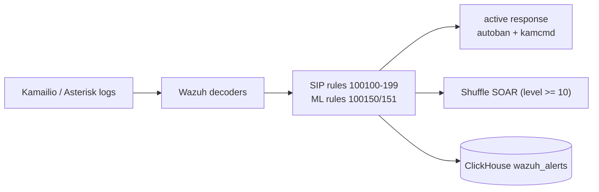

# SIEM

The correlation and response layer. Wazuh is one of the three detection arms
(alongside Suricata signatures and the Stage-1 ML classifier): it decodes the SIP
edge logs, fires the SIP correlation rules, and drives active response.

## Contents

| Path | Role |
|---|---|
| [`wazuh/`](wazuh/README.md) | Wazuh manager, indexer, and dashboard config: decoders, the SIP rules (`100100`-`100199`) and ML rules (`100150`/`100151`), active response, the Shuffle integration, and OIDC. |
| [`adapter/`](adapter/README.md) | The Kamailio → Wazuh adapter that emits `NGN-SEC` events so the SIP rules fire on real source IPs. |
| [`sigma/`](sigma/README.md) | The Sigma detection rules and their mapping to the Wazuh SIDs. |

## Flow

Alerts also flow into ClickHouse (via Vector) so the Wazuh arm can be compared
against Suricata and the ML classifier on identical windows. See the top-level
[`README`](../README.md) and [`docs/04_detection_rules.md`](../docs/04_detection_rules.md).
